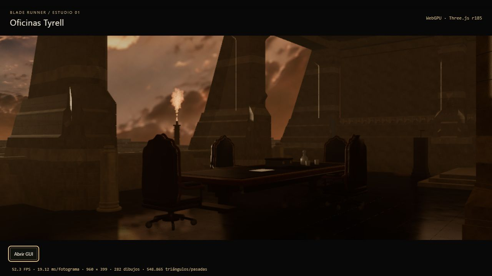

# Registro cronológico de capturas

Formato: `PUNTO_NNN_AAAA-MM-DD_CAMxx.png`. Contador creciente por punto, también entre revisiones y cámaras. No sobrescribir. Próxima captura de 4.3: **007**; de 4.4: **006**; de 4.5: **010**; de 4.6: **011**; de 5.1: **008**; de 5.2: **008**; de 5.3: **012**; de 5.4: **008**; de 5.5: **006**; de 6.1: **010**. Guardar una nueva captura al completar cada punto y registrar su estado; un resultado rechazado reabre el punto.

## 6.2 · Haces de luz y polvo

Entrega del 09–10/09/2026. Horas UTC; Madrid +2 h. Los nombres usan la fecha local y el contador sigue creciendo al cambiar de día. Pantallazos PNG 893 × 912, convertidos desde la imagen del navegador sin cambiar tamaño ni píxeles. Diálogo de captura fija 1920 × 800, sin paneo, salvo 012 (visor vivo). Condiciones: Tyrell v1, luz 4.2/balance R01, Base R01 indirecta, 0 EV, normal activa; ambos reflejos activos, Piedra pulida/Auto/adaptativo, calidad Media salvo 007–008. Las capas de 6.1 están activas a 1 salvo donde se indica apagado. [Informe y límites](../phase6/6.2/VOLUMEN.md).

**Propuesta para revisión: 031–033.** 001–026 son comparaciones y diagnósticos históricos, no entregas aprobadas. El problema de actualización de materiales se resuelve en 027–033. No se sobrescriben ensayos descartados.

| Orden | Fecha/hora UTC | Archivo | Estado |
| --- | --- | --- | --- |
| 6.2 / 001 | 09/09 21:38:15 | [CAM01](6.2_001_2026-09-09_CAM01.png) | Base 6.1 previa; después se detectó actualización incompleta de bruma en materiales compartidos. |
| 6.2 / 002 | 09/09 21:40:53 | [CAM01](6.2_002_2026-09-09_CAM01.png) | Ensayo inicial descartado: dispersión excesiva, piedra lavada. |
| 6.2 / 003 | 09/09 21:45:01 | [CAM01](6.2_003_2026-09-09_CAM01.png) | Volumen acotado, polvo animado; reflejo continuo. Diagnóstico 003 disponible. |
| 6.2 / 004 | 09/09 21:45:30 | [CAM04](6.2_004_2026-09-09_CAM04.png) | Ensayo acotado, CAM 04, anterior a la corrección de actualización. |
| 6.2 / 005 | 09/09 21:45:42 | [CAM02](6.2_005_2026-09-09_CAM02.png) | Ensayo acotado, CAM 02, anterior a la corrección de actualización. |
| 6.2 / 006 | 09/09 21:46:55 | [CAM01](6.2_006_2026-09-09_CAM01.png) | Polvo apagado, haces activos, Media. Diagnóstico 006 disponible. |
| 6.2 / 007 | 09/09 21:48:35 | [CAM01](6.2_007_2026-09-09_CAM01.png) | Calidad Baja, polvo apagado; 24 muestras y nueva sombra. |
| 6.2 / 008 | 09/09 21:49:31 | [CAM01](6.2_008_2026-09-09_CAM01.png) | Calidad Alta, polvo apagado; 64 muestras. |
| 6.2 / 009 | 09/09 21:50:45 | [CAM01](6.2_009_2026-09-09_CAM01.png) | Actualización planar limitada, polvo animado; anterior a corrección de materiales. Diagnóstico 009. |
| 6.2 / 010 | 09/09 21:51:53 | [CAM04](6.2_010_2026-09-09_CAM04.png) | Vista lateral con actualización limitada, anterior a corrección de materiales. |
| 6.2 / 011 | 09/09 21:52:06 | [CAM01](6.2_011_2026-09-09_CAM01.png) | Control de apagado: diferencia detectada respecto a la base previa; no validado como restauración. |
| 6.2 / 012 | 09/09 21:52:26 | [CAM01](6.2_012_2026-09-09_CAM01.png) | Visor vivo con paneo; anterior a corrección de materiales. Diagnóstico 012. |
| 6.2 / 013 | 09/09 21:56:04 | [CAM01](6.2_013_2026-09-09_CAM01.png) | Carga limpia sin volumen; coincide con 001. |
| 6.2 / 014 | 09/09 21:57:26 | [CAM01](6.2_014_2026-09-09_CAM01.png) | Ensayo de restauración: variantes explícitas; diferencia persistente. |
| 6.2 / 015 | 09/09 21:58:37 | [CAM01](6.2_015_2026-09-09_CAM01.png) | Control de restauración tras renovar sombras; diferencia persistente. |
| 6.2 / 016 | 09/09 21:59:54 | [CAM01](6.2_016_2026-09-09_CAM01.png) | Control tras renovar materiales; diferencia persistente. |
| 6.2 / 017 | 09/09 22:00:51 | [CAM01](6.2_017_2026-09-10_CAM01.png) | Atmósfera completamente apagada; coincide con base sin atmósfera. Diagnóstico 017. |
| 6.2 / 018 | 09/09 22:02:09 | [CAM01](6.2_018_2026-09-10_CAM01.png) | Reactivación manual de profundidad; referencia usada para aislar actualización de parámetros. |
| 6.2 / 019 | 09/09 22:05:23 | [CAM01](6.2_019_2026-09-10_CAM01.png) | Ensayo de renovación de enlaces; no resuelve diferencia. |
| 6.2 / 020 | 09/09 22:08:22 | [CAM01](6.2_020_2026-09-10_CAM01.png) | Volumen con origen por matriz de cámara; ensayo de diagnóstico. |
| 6.2 / 021 | 09/09 22:08:37 | [CAM01](6.2_021_2026-09-10_CAM01.png) | Apagado con origen por matriz; diferencia persistente. |
| 6.2 / 022 | 09/09 22:09:59 | [CAM01](6.2_022_2026-09-10_CAM01.png) | Repetición estabilizada; diferencia persistente. |
| 6.2 / 023 | 09/09 22:13:56 | [CAM01](6.2_023_2026-09-10_CAM01.png) | Ensayo de grafo único antes de corregir observador; no validado. |
| 6.2 / 024 | 09/09 22:18:23 | [CAM01](6.2_024_2026-09-10_CAM01.png) | Ensayo de limpieza mediante renders inmediatos; descartado. |
| 6.2 / 025 | 09/09 22:22:28 | [CAM01](6.2_025_2026-09-10_CAM01.png) | Ensayo de transición entre fotogramas; descartado. |
| 6.2 / 026 | 09/09 22:27:13 | [CAM01](6.2_026_2026-09-10_CAM01.png) | Ensayo de parámetros compartidos por render; aún anterior a corrección del observador. |
| 6.2 / 027 | 09/09 22:37:35 | [CAM01](6.2_027_2026-09-10_CAM01.png) | Base de profundidad corregida: ambos controles se aplican ahora a todos los materiales. |
| 6.2 / 028 | 09/09 22:38:07 | [CAM01](6.2_028_2026-09-10_CAM01.png) | Haces y polvo activos con actualización de materiales corregida. |
| 6.2 / 029 | 09/09 22:38:16 | [CAM01](6.2_029_2026-09-10_CAM01.png) | Haces apagados: idéntica a 027 en el rectángulo de escena; restauración validada. |
| 6.2 / 030 | 09/09 22:39:17 | [CAM01](6.2_030_2026-09-10_CAM01.png) | Toda la atmósfera apagada; idéntica a 6.1/009, base conservada. |
| 6.2 / 031 | 09/09 22:39:34 | [CAM01](6.2_031_2026-09-10_CAM01.png) | Propuesta final CAM 01; ambas capas y haces a 1, polvo activo. Diagnóstico 031. |
| 6.2 / 032 | 09/09 22:39:46 | [CAM04](6.2_032_2026-09-10_CAM04.png) | Propuesta final CAM 04 con controles corregidos. |
| 6.2 / 033 | 09/09 22:39:59 | [CAM02](6.2_033_2026-09-10_CAM02.png) | Propuesta final CAM 02 con controles corregidos. |

La escena se deja en CAM 01, Media, con profundidad, haces, polvo y ambos reflejos activos. Al recargar vuelve a la base sin estos efectos. Próxima captura de 6.2: **034**.

## 6.1 · Profundidad exterior y bruma interior

09/09/2026, horas UTC (Madrid +2 h). Pantallazos PNG 893 × 912, convertidos desde la imagen del navegador sin modificar tamaño ni píxeles. Captura fija 1920 × 800 reducida en diálogo, sin paneo, salvo 008 (visor vivo). Todos: Media, Tyrell v1, luz 4.2/balance R01, Base R01 indirecta, 0 EV, normales activas, reflejo Piedra pulida/Auto/adaptativo y entorno metal/vidrio activados. [Informe](../phase6/6.1/ATMOSFERA.md).

| Orden | Hora | Archivo | Estado |
| --- | --- | --- | --- |
| 6.1 / 001 | 20:15:37 | [CAM 01](6.1_001_2026-09-09_CAM01.png) | Base anterior, sin atmósfera |
| 6.1 / 002 | 20:19:37 | [CAM 01](6.1_002_2026-09-09_CAM01.png) | Sólo exterior 0,002 /m; descartado por aclarado excesivo |
| 6.1 / 003 | 20:19:49 | [CAM 01](6.1_003_2026-09-09_CAM01.png) | Sólo interior, intensidad 1; propuesta tenue |
| 6.1 / 004 | 20:22:53 | [CAM 01](6.1_004_2026-09-09_CAM01.png) | Sólo exterior corregido 0,00025 /m, intensidad 1 |
| 6.1 / 005 | 20:23:07 | [CAM 01](6.1_005_2026-09-09_CAM01.png) | Ambas capas a 1; propuesta final de 6.1, pendiente de revisión del usuario. [Diagnóstico](6.1_005_2026-09-09_CAM01.json) |
| 6.1 / 006 | 20:23:35 | [CAM 02](6.1_006_2026-09-09_CAM02.png) | Ambas capas a 1; mesa y cristalería |
| 6.1 / 007 | 20:23:48 | [CAM 04](6.1_007_2026-09-09_CAM04.png) | Ambas capas a 1; vista lateral |
| 6.1 / 008 | 20:24:00 | [CAM 01](6.1_008_2026-09-09_CAM01.png) | Ambas capas a 1; visor con paneo. [Diagnóstico](6.1_008_2026-09-09_CAM01.json) |
| 6.1 / 009 | 20:24:31 | [CAM 01](6.1_009_2026-09-09_CAM01.png) | Ambas capas apagadas; base restaurada, rectángulo de escena idéntico a 001 |

Se deja el visor en CAM 01 con ambas capas y reflejos activos para revisión. Al recargar esos cuatro efectos arrancan apagados. R01 archivado intacto; no se registra una nueva versión de acabado.

## Entrega conjunta 5.3–5.5

09/09/2026. Horas UTC (Madrid +2 h). Todos son pantallazos 893 × 912, codificados como PNG desde la imagen entregada por el navegador, sin cambiar tamaño o contenido visual. Salvo 5.3/011, muestran el diálogo de captura fija 1920 × 800 reducido, sin paneo. Tyrell v1, luz 4.2 con balance R01, Base R01 indirecta, 0 EV y normales activas. Calidad Media salvo las excepciones indicadas. El reflector planar usa Piedra pulida 5.2.

### 5.3 · Cámaras

Reflejo planar activado, entorno de metal/vidrio desactivado. 001–010: compilación 5.2 con actualización continua; 011: compilación final con caché adaptativa.

| Orden | Hora | Archivo | Vista y estado |
| --- | --- | --- | --- |
| 5.3 / 001 | 19:31:09 | [CAM 01](5.3_001_2026-09-09_CAM01.png) | General |
| 5.3 / 002 | 19:31:50 | [CAM 03](5.3_002_2026-09-09_CAM03.png) | Columnas invertidas, poco suelo visible |
| 5.3 / 003 | 19:33:16 | [CAM 05](5.3_003_2026-09-09_CAM05.png) | Camera_B, fondo inverso pendiente |
| 5.3 / 004 | 19:35:22 | [CAM 06](5.3_004_2026-09-09_CAM06.png) | Camera_C, lateral inverso |
| 5.3 / 005 | 19:37:14 | [CAM 07](5.3_005_2026-09-09_CAM07.png) | Camera_D, mesa desde atrás |
| 5.3 / 006 | 19:37:52 | [CAM 08](5.3_006_2026-09-09_CAM08.png) | Camera_E, plano cerrado de mesa |
| 5.3 / 007 | 19:38:09 | [CAM 09](5.3_007_2026-09-09_CAM09.png) | Camera_F, fondo/cielo limitado |
| 5.3 / 008 | 19:38:24 | [CAM 10](5.3_008_2026-09-09_CAM10.png) | Camera_free, pose fija elevada |
| 5.3 / 009 | 19:38:43 | [CAM 02](5.3_009_2026-09-09_CAM02.png) | Mesa y juntas |
| 5.3 / 010 | 19:39:07 | [CAM 04](5.3_010_2026-09-09_CAM04.png) | Lateral de referencia |
| 5.3 / 011 | 19:47:52 | [CAM 01 en vivo](5.3_011_2026-09-09_CAM01.png) | Paneo activo; no es captura fija. [Diagnóstico](5.3_011_2026-09-09_CAM01.json) |

[Conclusiones y límites de las vistas inversas](../phase5/5.3/CAMARAS.md).

### 5.4 · Resolución y actualización

CAM 01, reflector activado y entorno de metal/vidrio desactivado.

| Orden | Hora | Archivo | Estado |
| --- | --- | --- | --- |
| 5.4 / 001 | 19:40:56 | [Iteración inicial](5.4_001_2026-09-09_CAM01.png) | Caché sin reutilización, corregida después; [diagnóstico](5.4_001_2026-09-09_CAM01.json) |
| 5.4 / 002 | 19:46:04 | [Adaptativo corregido](5.4_002_2026-09-09_CAM01.png) | Auto/Media, 50 %; [1 render / 871 reutilizaciones](5.4_002_2026-09-09_CAM01.json) antes de capturar |
| 5.4 / 003 | 19:46:38 | [25 %](5.4_003_2026-09-09_CAM01.png) | Resolución manual 25 %, adaptativo |
| 5.4 / 004 | 19:47:15 | [100 %](5.4_004_2026-09-09_CAM01.png) | Resolución manual 100 %, adaptativo |
| 5.4 / 005 | 19:50:10 | [Continuo](5.4_005_2026-09-09_CAM01.png) | Auto/Media, cada render; [diagnóstico](5.4_005_2026-09-09_CAM01.json) |
| 5.4 / 006 | 19:50:35 | [Baja](5.4_006_2026-09-09_CAM01.png) | Auto/Baja, reflector 25 %, adaptativo |
| 5.4 / 007 | 19:50:51 | [Alta](5.4_007_2026-09-09_CAM01.png) | Auto/Alta, reflector 75 %, adaptativo |

[Parámetros, ahorro y limitaciones](../phase5/5.4/RENDIMIENTO.md). Media/Auto/adaptativo restaurados después.

### 5.5 · Metal y vidrio

Reflector planar activado, Media, Auto 50 %. 001–002 pertenecen a la primera compilación; 003–005 incluyen la caché corregida.

| Orden | Hora | Archivo | Estado |
| --- | --- | --- | --- |
| 5.5 / 001 | 19:41:14 | [CAM 02 sin entorno](5.5_001_2026-09-09_CAM02.png) | Comparación inicial |
| 5.5 / 002 | 19:43:27 | [CAM 02 con entorno](5.5_002_2026-09-09_CAM02.png) | Una captura local; [diagnóstico](5.5_002_2026-09-09_CAM02.json) |
| 5.5 / 003 | 19:52:14 | [CAM 02 final](5.5_003_2026-09-09_CAM02.png) | R01 restaurado después de estudio; tres capturas locales, [diagnóstico](5.5_003_2026-09-09_CAM02.json) |
| 5.5 / 004 | 19:53:37 | [CAM 04 final](5.5_004_2026-09-09_CAM04.png) | Ambos reflejos activados |
| 5.5 / 005 | 19:54:15 | [CAM 01 final](5.5_005_2026-09-09_CAM01.png) | Estado dejado para revisión; [diagnóstico final](5.5_005_2026-09-09_CAM01.json) |

[Fuente, coste y límites del entorno](../phase5/5.5/ENTORNO.md). 23 pantallazos nuevos en total; R01 archivado permanece intacto. Al recargar, los dos controles de reflexión arrancan desactivados.

## Entrega 5.2 · Reflejo de piedra pulida

09/09/2026. Horas UTC (Madrid +2 h). Media, Tyrell v1, luz 4.2 con balance R01, Base R01 indirecta, composición completa y 0 EV. Reflejo activado y cámara fija sin paneo. El render de referencia es 1920 × 800, mostrado reducido en la interfaz. El navegador entregó pantallazos JPEG, codificados como PNG sin cambiar tamaño ni contenido visual.

| Orden | Hora UTC | Archivo | Tamaño del pantallazo | Estado |
| --- | --- | --- | --- | --- |
| 5.2 / 001 | 19:16:32 | [CAM 01](5.2_001_2026-09-09_CAM01.png) | 1294 × 912 | Referencia: compilación anterior, ensayo uniforme 5.1 |
| 5.2 / 002 | 19:18:54 | [CAM 01](5.2_002_2026-09-09_CAM01.png) | 893 × 912 | Piedra 5.2, normales activas; [diagnóstico](5.2_002_2026-09-09_CAM01.json) |
| 5.2 / 003 | 19:19:16 | [CAM 04](5.2_003_2026-09-09_CAM04.png) | 893 × 912 | Piedra 5.2, normales activas |
| 5.2 / 004 | 19:19:58 | [CAM 04](5.2_004_2026-09-09_CAM04.png) | 893 × 912 | Comparador uniforme 5.1, normales activas |
| 5.2 / 005 | 19:20:36 | [CAM 04](5.2_005_2026-09-09_CAM04.png) | 893 × 912 | Piedra 5.2, normales desactivadas para comprobación |
| 5.2 / 006 | 19:22:15 | [CAM 04](5.2_006_2026-09-09_CAM04.png) | 893 × 912 | Compilación final, piedra 5.2 y normales activas |
| 5.2 / 007 | 19:23:31 | [CAM 01](5.2_007_2026-09-09_CAM01.png) | 893 × 912 | Final para revisión; [diagnóstico](5.2_007_2026-09-09_CAM01.json) |

El tamaño de ventana cambió entre 001 y 002; no comparar píxeles directamente entre ellas. 003/004 permiten comparar ambos acabados a igual tamaño. [Parámetros, validación y límites](../phase5/5.2/MATERIAL.md). R01 archivado intacto; no se registra una nueva versión de acabado.

## Entrega 5.1 · Ensayo de reflejo planar

09/09/2026, sesión desde 18:53 UTC (20:53 Madrid). Media, Tyrell v1, luz 4.2 con balance R01, Base R01 indirecta, composición completa y 0 EV. Cámara fija sin paneo. Pantallazos de interfaz 1294 × 912 con render 1920 × 800 reducido. No son PNG nativos de 1920 × 800.

| Orden | Archivo | Estado |
| --- | --- | --- |
| 5.1 / 001 | [CAM 01](5.1_001_2026-09-09_CAM01.png) | Sin reflejo planar; [diagnóstico base](5.1_001_2026-09-09_CAM01.json) |
| 5.1 / 002 | [CAM 01](5.1_002_2026-09-09_CAM01.png) | Ensayo activado, primera compilación; [coste observado](5.1_002_2026-09-09_CAM01.json) |
| 5.1 / 003 | [CAM 04](5.1_003_2026-09-09_CAM04.png) | Ensayo lateral, primera compilación |
| 5.1 / 004 | [CAM 04](5.1_004_2026-09-09_CAM04.png) | Compilación final, cámaras reutilizadas; reflejo activado |
| 5.1 / 005 | [CAM 02](5.1_005_2026-09-09_CAM02.png) | Compilación final, reflejo activado |
| 5.1 / 006 | [CAM 01](5.1_006_2026-09-09_CAM01.png) | Vuelta a R01 sin reflejo planar; [diagnóstico](5.1_006_2026-09-09_CAM01.json), 277 dibujos y tres targets retenidos |
| 5.1 / 007 | [CAM 01](5.1_007_2026-09-09_CAM01.png) | Ensayo final activado para revisión; [diagnóstico](5.1_007_2026-09-09_CAM01.json), se mantienen tres targets tras repetir capturas |

[Informe, alcance y siguiente ajuste](../phase5/5.1/REFLECTOR.md). Se trata de un prototipo aditivo, no de una nueva referencia de acabado. R01 permanece como inicio al recargar.

## Entrega 4.6 · Fugas y contactos

09/09/2026. Horas UTC (Madrid: +2 h). Todas usan Tyrell v1, luz 4.2 con balance R01, Base R01 indirecta, composición completa, 0 EV y cámara de referencia sin paneo. Pantallazos de interfaz 1294 × 912 con render 1920 × 800 reducido.

| Orden | Hora UTC | Archivo | Calidad | Estado |
| --- | --- | --- | --- | --- |
| 4.6 / 001 | 18:09:53 | [CAM 01](4.6_001_2026-09-09_CAM01.png) | Media | Antes, base 4.5 |
| 4.6 / 002 | 18:10:33 | [CAM 02](4.6_002_2026-09-09_CAM02.png) | Media | Antes, base 4.5 |
| 4.6 / 003 | 18:14:27 | [CAM 01](4.6_003_2026-09-09_CAM01.png) | Media | Ensayo descartado: normalBias 10 mm y maletín apoyado |
| 4.6 / 004 | 18:15:01 | [CAM 02](4.6_004_2026-09-09_CAM02.png) | Media | Ensayo descartado; [diagnóstico](4.6_004_2026-09-09_CAM02.json) |
| 4.6 / 005 | 18:17:12 | [CAM 04](4.6_005_2026-09-09_CAM04.png) | Media | Ensayo descartado |
| 4.6 / 006 | 18:18:07 | [CAM 02](4.6_006_2026-09-09_CAM02.png) | Baja | Ensayo descartado: bandas de autosombra sobre la mesa |
| 4.6 / 007 | 18:21:42 | [CAM 02](4.6_007_2026-09-09_CAM02.png) | Baja | Final: normalBias restaurado a 25 mm, bandas del ensayo eliminadas |
| 4.6 / 008 | 18:22:20 | [CAM 02](4.6_008_2026-09-09_CAM02.png) | Media | Final: maletín apoyado, sombras 4.4 |
| 4.6 / 009 | 18:22:37 | [CAM 04](4.6_009_2026-09-09_CAM04.png) | Media | Final: revisión lateral |
| 4.6 / 010 | 18:22:52 | [CAM 01](4.6_010_2026-09-09_CAM01.png) | Media | Final: general; [diagnóstico](4.6_010_2026-09-09_CAM01.json) |

[Mediciones, corrección y límites](../phase4/4.6/CONTACTOS.md). Resultado listo para revisión del usuario; no constituye una nueva versión de acabado ni aprobación de fidelidad final. R01 archivado intacto.

## Entrega 4.5 · Iluminación indirecta

09/09/2026, sesión aproximadamente 17:12–17:16 UTC (19:12–19:16 Madrid). Todas en Media, Tyrell v1, luz 4.2 con parámetros R01, 0 EV, composición completa y cámara de referencia sin paneo. Pantallazos de interfaz 1294 × 912 con render 1920 × 800 reducido; no son PNG nativos de 1920 × 800.

| Orden | Archivo | Estado |
| --- | --- | --- |
| 4.5 / 001 | [CAM 01](4.5_001_2026-09-09_CAM01.png) | Base R01, antes de los ensayos |
| 4.5 / 002 | [CAM 01](4.5_002_2026-09-09_CAM01.png) | Sonda difusa · ensayo |
| 4.5 / 003 | [CAM 01](4.5_003_2026-09-09_CAM01.png) | Entorno · ensayo |
| 4.5 / 004 | [CAM 02](4.5_004_2026-09-09_CAM02.png) | Entorno · ensayo |
| 4.5 / 005 | [CAM 02](4.5_005_2026-09-09_CAM02.png) | Sonda difusa · ensayo |
| 4.5 / 006 | [CAM 02](4.5_006_2026-09-09_CAM02.png) | Base R01 |
| 4.5 / 007 | [CAM 04](4.5_007_2026-09-09_CAM04.png) | Sonda difusa · ensayo |
| 4.5 / 008 | [CAM 04](4.5_008_2026-09-09_CAM04.png) | Entorno · ensayo |
| 4.5 / 009 | [CAM 04](4.5_009_2026-09-09_CAM04.png) | Base R01 restaurada |

Se conserva Base R01 como resultado. [Informe y validación](../phase4/4.5/INDIRECTA.md). Diagnósticos: [sonda CAM 04](4.5_007_2026-09-09_CAM04.json), [entorno CAM 04](4.5_008_2026-09-09_CAM04.json) y [Base R01 CAM 01](4.5_001_2026-09-09_CAM01.json). Este último se guardó al finalizar la sesión, tras restaurar la base; acompaña a 001 pero no es simultáneo a esa captura. Archivo R01 intacto.

## Entrega 4.4 · Sombras

09/09/2026, sesión 17:00–17:04 UTC. Todas en Media, Tyrell v1, luz R01, 0 EV, composición completa, cámara de referencia sin paneo. Interfaz 1294 × 912 con render 1920 × 800 reducido.

| Orden | Archivo | Estado |
| --- | --- | --- |
| 4.4 / 001 | [CAM 01](4.4_001_2026-09-09_CAM01.png) | Antes: página en caché, sombras R01 |
| 4.4 / 002 | [CAM 02](4.4_002_2026-09-09_CAM02.png) | Antes: sombras opacas de vidrio; [diagnóstico 4.3](4.4_002_2026-09-09_CAM02.json) |
| 4.4 / 003 | [CAM 02](4.4_003_2026-09-09_CAM02.png) | Después: revisión 4.4 confirmada, vidrio con sombra parcial |
| 4.4 / 004 | [CAM 01](4.4_004_2026-09-09_CAM01.png) | Después: cobertura y mobiliario. [Diagnóstico final](4.4_004_2026-09-09_CAM01.json) tomado después de probar paneo |
| 4.4 / 005 | [CAM 04](4.4_005_2026-09-09_CAM04.png) | Después: cobertura lateral, 17:03:54 UTC |

Se conservaron las dos capturas iniciales al detectar que la página anterior seguía en caché. [Informe de la entrega](../phase4/4.4/SOMBRAS.md). R01 archivado sin cambios.

| Orden | Fecha/hora | Archivo | Perfil y condiciones | Estado |
| --- | --- | --- | --- | --- |
| 4.3 / 001 | 09/09/2026, anterior a 002; hora original no registrada | [4.3_001_2026-09-09_CAM01.png](4.3_001_2026-09-09_CAM01.png) | Luz 4.3, CAM 01, Media, Tyrell v1, 0 EV, composición completa | Rechazada: demasiado oscura. Copia histórica de `../phase4/4.3/cam01-43.png`, no una nueva captura |
| 4.3 / 002 | 09/09/2026 12:27 UTC (14:27 Madrid) | [4.3_002_2026-09-09_CAM01.png](4.3_002_2026-09-09_CAM01.png) | Luz 4.2 corregida, CAM 01, Media, Tyrell v1, 0 EV, composición completa | Base restaurada para revisión; no resultado final aprobado |
| 4.3 / 003 | 09/09/2026 12:34:46 UTC (14:34:46 Madrid) | [4.3_003_2026-09-09_CAM01.png](4.3_003_2026-09-09_CAM01.png) | Base 4.2, sol 2,5, ambiente 0,86, CAM 01, Media, Tyrell v1, 0 EV | Ajuste solicitado de penumbra y contraste; pendiente de revisión visual del usuario. [Diagnóstico](4.3_003_2026-09-09_CAM01.json) |
| 4.3 / 004 | 09/09/2026, sesión 16:50–16:51 UTC | [4.3_004_2026-09-09_CAM01.png](4.3_004_2026-09-09_CAM01.png) | R01, CAM 01, Media, 0 EV | Base conservada para continuar |
| 4.3 / 005 | 09/09/2026, sesión 16:50–16:51 UTC | [4.3_005_2026-09-09_CAM02.png](4.3_005_2026-09-09_CAM02.png) | R01, CAM 02, Media, 0 EV | Revisión de mesa; sombras de vidrio pendientes |
| 4.3 / 006 | 09/09/2026 16:51:04 UTC | [4.3_006_2026-09-09_CAM04.png](4.3_006_2026-09-09_CAM04.png) | R01, CAM 04, Media, 0 EV | Revisión lateral, continuidad hacia 4.4 |

004–006: interfaz 1294 × 912 con captura de referencia 1920 × 800 reducida, sin paneo y composición completa. Se mantienen los parámetros R01; se descarta la propuesta de áreas reducidas. No son una nueva versión de acabado ni aprobación final de fidelidad cinematográfica.

Ambas muestran el render fijo 1920 × 800 sin paneo dentro del diálogo de captura. Son pantallazos de interfaz: 001 tiene 1280 × 720 y 002 tiene 1294 × 912, por cambio del tamaño de la ventana. Para comparación de píxeles, usar el mismo tamaño de ventana en próximas capturas o guardar los PNG originales 1920 × 800. Se conserva todo el histórico.

Restauración compilada sin errores (Webpack, 33,667 s; tres advertencias de empaquetado). El único cambio de ejecución de esta revisión es el perfil inicial de luz. El punto 4.3 queda pendiente según la revisión del usuario.

003 tiene 1294 × 912, igual que 002, y muestra la misma captura fija sin paneo. Revisión de contraste compilada sin errores en 30,132 s (tres advertencias de empaquetado). Exposición y fuentes de relleno sin cambios.

## 6.3 · Oclusión y estabilidad (10-09-2026)

Ambos reflejos, profundidad exterior, bruma interior y haces activos; intensidades 1 y exposición 0 EV. Polvo según fila, velocidad 1. Pantallazos PNG de 893 × 912; salvo paneo, diálogo de referencia 1920 × 800 reducido. Orden global por punto, horas UTC. 001–005: versión 6.2; 006–012: compilación 6.3.

| Archivo | Hora UTC | Calidad | Estado |
| --- | --- | --- | --- |
| [6.3_001_2026-09-10_CAM01.png](6.3_001_2026-09-10_CAM01.png) | 2026-09-10 07:43:25 | Media | Base 6.2; polvo apagado |
| [6.3_002_2026-09-10_CAM01.png](6.3_002_2026-09-10_CAM01.png) | 2026-09-10 07:43:56 | Baja | Comparacion de calidad; polvo apagado |
| [6.3_003_2026-09-10_CAM01.png](6.3_003_2026-09-10_CAM01.png) | 2026-09-10 07:44:33 | Alta | Comparacion de calidad; polvo apagado |
| [6.3_004_2026-09-10_CAM03.png](6.3_004_2026-09-10_CAM03.png) | 2026-09-10 07:46:03 | Media | Perfiles invertidos; polvo apagado |
| [6.3_005_2026-09-10_CAM01-paneo.png](6.3_005_2026-09-10_CAM01-paneo.png) | 2026-09-10 07:47:04 | Media | Paneo asentado; polvo apagado; visor directo |
| [6.3_006_2026-09-10_CAM01.png](6.3_006_2026-09-10_CAM01.png) | 2026-09-10 07:50:47 | Media | 6.3 final; primera muestra estatica |
| [6.3_007_2026-09-10_CAM01.png](6.3_007_2026-09-10_CAM01.png) | 2026-09-10 07:51:10 | Media | Repeticion estatica |
| [6.3_008_2026-09-10_CAM01.png](6.3_008_2026-09-10_CAM01.png) | 2026-09-10 07:51:21 | Media | Tras apagar/encender haces |
| [6.3_009_2026-09-10_CAM02.png](6.3_009_2026-09-10_CAM02.png) | 2026-09-10 07:51:45 | Media | Detalle de mesa y juntas; polvo apagado |
| [6.3_010_2026-09-10_CAM04.png](6.3_010_2026-09-10_CAM04.png) | 2026-09-10 07:52:00 | Media | Vista lateral; polvo apagado |
| [6.3_011_2026-09-10_CAM01-paneo.png](6.3_011_2026-09-10_CAM01-paneo.png) | 2026-09-10 07:52:39 | Media | Paneo asentado; polvo animado; visor directo y JSON |
| [6.3_012_2026-09-10_CAM01.png](6.3_012_2026-09-10_CAM01.png) | 2026-09-10 07:53:07 | Media | Entrega final; polvo animado |

[Informe, comparación de píxeles y límites](../phase6/6.3/ESTABILIDAD.md).

## 6.4 · Bloom y acabado (10-09-2026)

Ambos reflejos, profundidad exterior, bruma y haces activos a intensidad 1; exposición 0 EV. Polvo apagado salvo 018–019 (velocidad 1). Bloom 0,16, radio 0,25, umbral 1,5; color 1, salvo filas OFF. 002–003 sin compresión de energía; 005 en adelante con límite 4. 011 en adelante: render anidado corregido. PNG 893 × 912 con diálogo de referencia 1920 × 800 reducido, salvo paneo. Horas UTC; nombres con fecha local.

| Archivo | Hora UTC | Calidad | Estado |
| --- | --- | --- | --- |
| [6.4_001_2026-09-10_CAM01.png](6.4_001_2026-09-10_CAM01.png) | 2026-09-10 08:07:53 | Media | Base 6.3, bloom/color OFF |
| [6.4_002_2026-09-10_CAM01.png](6.4_002_2026-09-10_CAM01.png) | 2026-09-10 08:10:44 | Media | Primer bloom sin limite, color OFF; descartado |
| [6.4_003_2026-09-10_CAM01.png](6.4_003_2026-09-10_CAM01.png) | 2026-09-10 08:11:00 | Media | Primer bloom y color; descartado |
| [6.4_004_2026-09-10_CAM01.png](6.4_004_2026-09-10_CAM01.png) | 2026-09-10 08:12:20 | Media | Restauracion OFF |
| [6.4_005_2026-09-10_CAM01.png](6.4_005_2026-09-10_CAM01.png) | 2026-09-10 08:14:38 | Media | Bloom limitado + color; ensayo |
| [6.4_006_2026-09-10_CAM01.png](6.4_006_2026-09-10_CAM01.png) | 2026-09-10 08:14:52 | Media | Repeticion ensayo |
| [6.4_007_2026-09-10_CAM01.png](6.4_007_2026-09-10_CAM01.png) | 2026-09-10 08:15:26 | Media | Restauracion OFF |
| [6.4_008_2026-09-10_CAM02.png](6.4_008_2026-09-10_CAM02.png) | 2026-09-10 08:15:42 | Media | CAM02 ensayo; detectado fondo negro |
| [6.4_009_2026-09-10_CAM04.png](6.4_009_2026-09-10_CAM04.png) | 2026-09-10 08:16:15 | Media | CAM04 ensayo |
| [6.4_010_2026-09-10_CAM02.png](6.4_010_2026-09-10_CAM02.png) | 2026-09-10 08:16:28 | Media | CAM02 base OFF |
| [6.4_011_2026-09-10_CAM02.png](6.4_011_2026-09-10_CAM02.png) | 2026-09-10 08:19:39 | Media | CAM02 final corregida |
| [6.4_012_2026-09-10_CAM01.png](6.4_012_2026-09-10_CAM01.png) | 2026-09-10 08:19:52 | Media | CAM01 final estatica |
| [6.4_013_2026-09-10_CAM01.png](6.4_013_2026-09-10_CAM01.png) | 2026-09-10 08:20:13 | Media | Repeticion final estatica |
| [6.4_014_2026-09-10_CAM01.png](6.4_014_2026-09-10_CAM01.png) | 2026-09-10 08:20:26 | Media | Restauracion final OFF |
| [6.4_015_2026-09-10_CAM01.png](6.4_015_2026-09-10_CAM01.png) | 2026-09-10 08:21:06 | Baja | Final Baja |
| [6.4_016_2026-09-10_CAM01.png](6.4_016_2026-09-10_CAM01.png) | 2026-09-10 08:21:43 | Alta | Final Alta |
| [6.4_017_2026-09-10_CAM04.png](6.4_017_2026-09-10_CAM04.png) | 2026-09-10 08:22:00 | Media | CAM04 final |
| [6.4_018_2026-09-10_CAM01-paneo.png](6.4_018_2026-09-10_CAM01-paneo.png) | 2026-09-10 08:22:27 | Media | Paneo con polvo animado; visor directo y JSON |
| [6.4_019_2026-09-10_CAM01.png](6.4_019_2026-09-10_CAM01.png) | 2026-09-10 08:22:54 | Media | Entrega final con polvo animado |

[Informe y validación](../phase6/6.4/ACABADO.md).

## GUI plegable · 10-09-2026

Cambio adicional de interfaz; no cierra 6.5. Ocultar/abrir conserva controles y secciones desplegadas. Comprobado en navegador; compilación correcta en 109,079 s, tres advertencias existentes de tamaño. Capturas de interfaz, no comparación de acabado: durante la revisión varió el encuadre. 003–004 documentan el ciclo final de reapertura/cierre con bloom y color activos. Horas UTC.

| Archivo | Hora UTC |
| --- | --- |
| [GUI_001_2026-09-10_oculta.png](GUI_001_2026-09-10_oculta.png) | 2026-09-10 08:54:23 |
| [GUI_002_2026-09-10_abierta.png](GUI_002_2026-09-10_abierta.png) | 2026-09-10 08:54:43 |
| [GUI_003_2026-09-10_reabierta.png](GUI_003_2026-09-10_reabierta.png) | 2026-09-10 08:55:09 |
| [GUI_004_2026-09-10_oculta.png](GUI_004_2026-09-10_oculta.png) | 2026-09-10 08:55:09 |

### FPS permanentes y nuevos valores iniciales

Arranque verificado en WebGPU: paneo H/V 1,1 m, suavidad 0,75 s, calidad Media y los siete efectos solicitados activos. GUI abierta/cerrada conserva la línea de FPS. 005 incluye diagnóstico JSON; 006 muestra la GUI oculta con FPS visibles. 40 pruebas correctas; build correcto en 65,927 s (tres advertencias existentes). Horas UTC.

| Archivo | Hora UTC |
| --- | --- |
| [GUI_005_2026-09-10_valores-iniciales.png](GUI_005_2026-09-10_valores-iniciales.png) | 2026-09-10 09:10:31 |
| [GUI_006_2026-09-10_FPS-visibles.png](GUI_006_2026-09-10_FPS-visibles.png) | 2026-09-10 09:10:43 |

## 6.5 · 10-09-2026

Media, CAM indicada, 0 EV, siete efectos activos salvo exclusión del nombre en 6.5/001–002. Polvo animado cuando hay haces. PNG 893 × 912, captura 1920 × 800 reducida salvo 6.5/003 (exportación JSON). Horas UTC.

| Archivo | Hora UTC |
| --- | --- |
| [6.5_001_2026-09-10_CAM01-sin-haces.png](6.5_001_2026-09-10_CAM01-sin-haces.png) | 2026-09-10 09:20:44 |
| [6.5_002_2026-09-10_CAM01-sin-reflejo.png](6.5_002_2026-09-10_CAM01-sin-reflejo.png) | 2026-09-10 09:21:26 |
| [6.5_003_2026-09-10_comparacion.png](6.5_003_2026-09-10_comparacion.png) | 2026-09-10 09:22:32 |
| [6.5_004_2026-09-10_CAM01-completa.png](6.5_004_2026-09-10_CAM01-completa.png) | 2026-09-10 09:22:52 |

## 6.6 · 10-09-2026

Media, CAM indicada, 0 EV, siete efectos activos salvo exclusión del nombre en 6.5/001–002. Polvo animado cuando hay haces. PNG 893 × 912, captura 1920 × 800 reducida salvo 6.5/003 (exportación JSON). Horas UTC.

| Archivo | Hora UTC |
| --- | --- |
| [6.6_001_2026-09-10_CAM01.png](6.6_001_2026-09-10_CAM01.png) | 2026-09-10 09:23:21 |
| [6.6_002_2026-09-10_CAM02.png](6.6_002_2026-09-10_CAM02.png) | 2026-09-10 09:23:39 |
| [6.6_003_2026-09-10_CAM04.png](6.6_003_2026-09-10_CAM04.png) | 2026-09-10 09:23:50 |

## 6.7 · 10-09-2026

Prueba de cielo panorámico. Media, siete efectos activos, polvo desactivado en 001–006 y activo en 007. PNG 893 × 912 con previsualización de la captura 1920 × 800. 001–002: versión anterior; 003–004 y 006–007: panorama activo; 005: control desactivado. Horas UTC.

| Archivo | Hora UTC |
| --- | --- |
| [6.7_001_2026-09-10_CAM01-original.png](6.7_001_2026-09-10_CAM01-original.png) | 2026-09-10 09:38:15 |
| [6.7_002_2026-09-10_CAM02-original.png](6.7_002_2026-09-10_CAM02-original.png) | 2026-09-10 09:41:26 |
| [6.7_003_2026-09-10_CAM01-panorama.png](6.7_003_2026-09-10_CAM01-panorama.png) | 2026-09-10 09:45:00 |
| [6.7_004_2026-09-10_CAM02-panorama.png](6.7_004_2026-09-10_CAM02-panorama.png) | 2026-09-10 09:47:32 |
| [6.7_005_2026-09-10_CAM02-desactivado.png](6.7_005_2026-09-10_CAM02-desactivado.png) | 2026-09-10 09:48:08 |
| [6.7_006_2026-09-10_CAM04-panorama.png](6.7_006_2026-09-10_CAM04-panorama.png) | 2026-09-10 09:48:28 |
| [6.7_007_2026-09-10_CAM01-final.png](6.7_007_2026-09-10_CAM01-final.png) | 2026-09-10 09:49:35 |

## 6.7 v2 · 10-09-2026

Revisión tras rechazo de v1. Panorama equirectangular único, Media, siete efectos y polvo activos. PNG 893 × 912 con previsualización 1920 × 800 reducida. 013 recupera el original para comparar; al terminar queda el panorama activo. Horas UTC.

| Archivo | Hora UTC |
| --- | --- |
| [6.7_008_2026-09-10_CAM01-v2.png](6.7_008_2026-09-10_CAM01-v2.png) | 2026-09-10 12:55:21 |
| [6.7_009_2026-09-10_CameraD-v2.png](6.7_009_2026-09-10_CameraD-v2.png) | 2026-09-10 12:55:53 |
| [6.7_010_2026-09-10_CameraE-v2.png](6.7_010_2026-09-10_CameraE-v2.png) | 2026-09-10 12:56:07 |
| [6.7_011_2026-09-10_CameraF-v2.png](6.7_011_2026-09-10_CameraF-v2.png) | 2026-09-10 12:56:26 |
| [6.7_012_2026-09-10_CAM02-v2.png](6.7_012_2026-09-10_CAM02-v2.png) | 2026-09-10 12:56:42 |
| [6.7_013_2026-09-10_CAM01-original-restaurado.png](6.7_013_2026-09-10_CAM01-original-restaurado.png) | 2026-09-10 12:57:00 |

## 6.7 v3 · 10-09-2026

Media, siete efectos activos, polvo desactivado para comparar. 014: original; 015: v3 frontal; 016/017: laterales D/F. PNG de interfaz con captura reducida. Horas UTC.

| Archivo | Hora UTC |
| --- | --- |
| [6.7_014_2026-09-10_CAM01-original-control.png](6.7_014_2026-09-10_CAM01-original-control.png) | 2026-09-10 13:29:11 |
| [6.7_015_2026-09-10_CAM01-v3.png](6.7_015_2026-09-10_CAM01-v3.png) | 2026-09-10 13:30:23 |
| [6.7_016_2026-09-10_CameraD-v3.png](6.7_016_2026-09-10_CameraD-v3.png) | 2026-09-10 13:30:53 |
| [6.7_017_2026-09-10_CameraF-v3.png](6.7_017_2026-09-10_CameraF-v3.png) | 2026-09-10 13:31:11 |

## 6.8 · 10-09-2026

Lens flare solar. PNG de interfaz 893 × 912 con captura 1920 × 800 reducida, salvo 007 (medición). Media salvo 005 Baja y 006 Alta. Polvo desactivado en 001–007 y activo en 008; resto de efectos activos. Flare desactivado en 002. Horas UTC.

| Archivo | Hora UTC |
| --- | --- |
| [6.8_001_2026-09-10_CAM01-flare.png](6.8_001_2026-09-10_CAM01-flare.png) | 2026-09-10 14:40:19 |
| [6.8_002_2026-09-10_CAM01-sin-flare.png](6.8_002_2026-09-10_CAM01-sin-flare.png) | 2026-09-10 14:40:58 |
| [6.8_003_2026-09-10_CAM02-fuera-campo.png](6.8_003_2026-09-10_CAM02-fuera-campo.png) | 2026-09-10 14:44:04 |
| [6.8_004_2026-09-10_CAM03.png](6.8_004_2026-09-10_CAM03.png) | 2026-09-10 14:44:32 |
| [6.8_005_2026-09-10_CAM01-Baja.png](6.8_005_2026-09-10_CAM01-Baja.png) | 2026-09-10 14:47:51 |
| [6.8_006_2026-09-10_CAM01-Alta.png](6.8_006_2026-09-10_CAM01-Alta.png) | 2026-09-10 14:48:41 |
| [6.8_007_2026-09-10_medicion.png](6.8_007_2026-09-10_medicion.png) | 2026-09-10 14:51:01 |
| [6.8_008_2026-09-10_CAM01-final.png](6.8_008_2026-09-10_CAM01-final.png) | 2026-09-10 14:51:35 |

## GUI: cabecera permanente y nuevos valores · 10-09-2026

Verificado en WebGPU: cabecera y FPS visibles con GUI oculta al arrancar, apertura/cierre y valores Baja, H 2 m, V 0,5 m, suavidad 1,4 s. Compilación correcta en 50,469 s con tres avisos de tamaño. Capturas PNG de interfaz; horas UTC.

| Archivo | Hora UTC |
| --- | --- |
| [GUI_007_2026-09-10_arranque-oculto.png](GUI_007_2026-09-10_arranque-oculto.png) | 2026-09-10 15:05:00 |
| [GUI_008_2026-09-10_valores-Baja-paneo.png](GUI_008_2026-09-10_valores-Baja-paneo.png) | 2026-09-10 15:05:37 |

## GUI: atajos numéricos de cámara · 10-09-2026

Verificadas teclas 1, 2, 5 y 0 en WebGPU, incluyendo 5 con GUI oculta y sincronización del selector. Compilación correcta en 94,496 s, tres avisos de tamaño. Horas UTC.

| Archivo | Hora UTC |
| --- | --- |
| [GUI_009_2026-09-10_tecla5-CameraB.png](GUI_009_2026-09-10_tecla5-CameraB.png) | 2026-09-10 15:29:56 |
| [GUI_010_2026-09-10_tecla1-CAM01.png](GUI_010_2026-09-10_tecla1-CAM01.png) | 2026-09-10 15:30:10 |

## 7.1 · Recorrido libre · 13-09-2026

Capturas del visor WebGPU en calidad Baja, orden temporal dentro del punto. Arrastre y Escape comprobados; regreso con 5 a Camera_B y 1 a CAM01.

| Archivo | Hora UTC |
| --- | --- |
| [7.1_001_2026-09-13_recorrido-pausado.jpg](7.1_001_2026-09-13_recorrido-pausado.jpg) | 2026-09-13T16:37:55.027078+00:00 |
| [7.1_002_2026-09-13_CAM01-controles.jpg](7.1_002_2026-09-13_CAM01-controles.jpg) | 2026-09-13T16:38:26.055931+00:00 |

## 7.2 · Transiciones · 13-09-2026

Orden temporal dentro del punto. Calidad Baja.

| Archivo | Hora UTC |
| --- | --- |
| [7.2_001_2026-09-13_controles.jpg](7.2_001_2026-09-13_controles.jpg) | 2026-09-13T17:21:19.846564+00:00 |
| [7.2_002_2026-09-13_CAM01-restaurada.jpg](7.2_002_2026-09-13_CAM01-restaurada.jpg) | 2026-09-13T17:22:27.990619+00:00 |

## 7.3 · Colisiones y proximidad · 13-09-2026

Orden temporal dentro del punto. Calidad Baja.

| Archivo | Hora UTC |
| --- | --- |
| [7.3_001_2026-09-13_mesa-recorrido.jpg](7.3_001_2026-09-13_mesa-recorrido.jpg) | 2026-09-13T18:05:09.499806+00:00 |
| [7.3_002_2026-09-13_pared-izquierda.jpg](7.3_002_2026-09-13_pared-izquierda.jpg) | 2026-09-13T18:05:50.567944+00:00 |
| [7.3_003_2026-09-13_valores-finales.jpg](7.3_003_2026-09-13_valores-finales.jpg) | 2026-09-13T18:07:21.487327+00:00 |

## 7.4 · Tamaño y foco · 13-09-2026

Orden temporal dentro del punto; calidad Baja.

| Archivo | Hora UTC |
| --- | --- |
| [7.4_001_2026-09-13_contenedor-completo.jpg](7.4_001_2026-09-13_contenedor-completo.jpg) | 2026-09-13T18:56:57.771745+00:00 |
| [7.4_002_2026-09-13_GUI-pausa-recorrido.jpg](7.4_002_2026-09-13_GUI-pausa-recorrido.jpg) | 2026-09-13T18:57:13.576361+00:00 |

## 7.5 · Experiencia y revisión técnica · 13-09-2026

Orden temporal dentro del punto; calidad Baja.

| Archivo | Hora UTC |
| --- | --- |
| [7.5_001_2026-09-13_GUI-experiencia.jpg](7.5_001_2026-09-13_GUI-experiencia.jpg) | 2026-09-13T19:52:52.745285+00:00 |
| [7.5_002_2026-09-13_revision-tecnica.jpg](7.5_002_2026-09-13_revision-tecnica.jpg) | 2026-09-13T19:53:12.676854+00:00 |

## 8.1 · Referencia de rendimiento · 13-09-2026

Viewport de medición 1920×1080, encuadre 2,4:1. Orden temporal dentro del punto.

| Archivo | Hora UTC |
| --- | --- |
| [8.1_001_2026-09-13_mediciones.jpg](8.1_001_2026-09-13_mediciones.jpg) | 2026-09-13T20:19:10.713907+00:00 |
| [8.1_002_2026-09-13_control-Baja.jpg](8.1_002_2026-09-13_control-Baja.jpg) | 2026-09-13T20:21:11.316787+00:00 |

## 8.2 · Presupuestos de render · 13-09-2026

Viewport 1920×1080; encuadre 2,4:1. Capturas de navegador JPEG; orden temporal dentro del punto.

| Archivo | Hora UTC |
| --- | --- |
| [8.2_001_2026-09-13_CAM01-Media-referencia.jpg](8.2_001_2026-09-13_CAM01-Media-referencia.jpg) | 2026-09-13T21:30:16.593366+00:00 |
| [8.2_002_2026-09-13_CAM01-Media-optimizada.jpg](8.2_002_2026-09-13_CAM01-Media-optimizada.jpg) | 2026-09-13T21:30:41.265904+00:00 |
| [8.2_003_2026-09-13_CAM02-Media-optimizada.jpg](8.2_003_2026-09-13_CAM02-Media-optimizada.jpg) | 2026-09-13T21:31:18.925366+00:00 |
| [8.2_004_2026-09-13_CAM02-Media-referencia.jpg](8.2_004_2026-09-13_CAM02-Media-referencia.jpg) | 2026-09-13T21:31:38.330797+00:00 |
| [8.2_005_2026-09-13_CAM01-Alta-optimizada.jpg](8.2_005_2026-09-13_CAM01-Alta-optimizada.jpg) | 2026-09-13T21:33:23.076620+00:00 |

## 9.0 · Preparación del exterior · 20-09-2026

PNG de pantalla 1920 × 1080; escena 2,4:1, render interno 1440 × 600. Baja optimizada 8.2, Tyrell v1, luz 4.2 (`tyrell-light-v2`), exposición 1,07 y efectos iniciales activos. Estado de todas: **base previa a Fase 9, sin cambios de escena**. Paneos y vista libre son muestras de revisión, no poses de captura centrada. [Informe y límites](../phase9/9.0/PREPARACION.md).

| Archivo | Hora UTC | Vista / tipo |
| --- | --- | --- |
| [9.0_001_2026-09-20_CAM01.png](9.0_001_2026-09-20_CAM01.png) | 2026-09-20T19:56:35.7364412Z | CAM01 centrada / pantalla |
| [9.0_002_2026-09-20_CAM02.png](9.0_002_2026-09-20_CAM02.png) | 2026-09-20T19:57:02.7341514Z | CAM02 / pantalla |
| [9.0_003_2026-09-20_CAM03.png](9.0_003_2026-09-20_CAM03.png) | 2026-09-20T19:57:12.9562795Z | CAM03 / pantalla |
| [9.0_004_2026-09-20_CAM04.png](9.0_004_2026-09-20_CAM04.png) | 2026-09-20T19:57:34.2784949Z | CAM04 / pantalla |
| [9.0_005_2026-09-20_CAM01-paneo.png](9.0_005_2026-09-20_CAM01-paneo.png) | 2026-09-20T19:57:55.8011126Z | CAM01, paneo superior izquierdo / pantalla |
| [9.0_006_2026-09-20_CAM01-paneo.png](9.0_006_2026-09-20_CAM01-paneo.png) | 2026-09-20T19:58:09.9439977Z | CAM01, paneo inferior derecho / pantalla |
| [9.0_007_2026-09-20_libre.png](9.0_007_2026-09-20_libre.png) | 2026-09-20T19:58:34.8467905Z | Libre desde CAM02 con giro, altura 1,65 m / pantalla |

## 9.1 · Continuidad urbana · 20-09-2026

Estado: **propuesta visual**, pendiente de valoración del usuario. Tyrell v1, luz 4.2, exposición 1,07, Baja optimizada 8.2, efectos iniciales y edificios bajos activos. PNG de pantalla 1920 × 1080, encuadre 2,4:1, render interno 1440 × 600. [Informe, cambios y límites](../phase9/9.1/CIUDAD.md).

| Archivo | Hora UTC | Vista / tipo |
| --- | --- | --- |
| [9.1_001_2026-09-20_CAM01.png](9.1_001_2026-09-20_CAM01.png) | 2026-09-20T20:16:12.1131288Z | CAM01 / pantalla |
| [9.1_002_2026-09-20_CAM04.png](9.1_002_2026-09-20_CAM04.png) | 2026-09-20T20:16:33.3271073Z | CAM04 / pantalla |
| [9.1_003_2026-09-20_CAM02.png](9.1_003_2026-09-20_CAM02.png) | 2026-09-20T20:16:34.0939260Z | CAM02 / pantalla |
| [9.1_004_2026-09-20_CAM03.png](9.1_004_2026-09-20_CAM03.png) | 2026-09-20T20:16:42.4967498Z | CAM03 / pantalla |
| [9.1_005_2026-09-20_CAM01-paneo.png](9.1_005_2026-09-20_CAM01-paneo.png) | 2026-09-20T20:17:20.7322654Z | CAM01 paneo inferior derecho / pantalla |
| [9.1_006_2026-09-20_CAM01-paneo.png](9.1_006_2026-09-20_CAM01-paneo.png) | 2026-09-20T20:17:52.7072452Z | CAM01 paneo superior izquierdo / pantalla |
| [9.1_007_2026-09-20_Camera-free.png](9.1_007_2026-09-20_Camera-free.png) | 2026-09-20T20:18:06.9245623Z | Camera_free elevada (preset) / pantalla |

## 9.1 · Revisión de altura y torres · 20-09-2026

Propuesta revisada: cubiertas −2,5 m y tres torres laterales. Tyrell v1, luz 4.2, exposición 1,07, Baja optimizada 8.2; efectos iniciales y ciudad activos. PNG 1920 × 1080, encuadre 2,4:1. 008 CAM01, 009 CAM02 (dos torres izquierdas), 010 Camera_D (torre derecha), 011 Camera_free elevada. Sin llamaradas. Pendiente de valoración artística.

| Archivo | Hora UTC |
| --- | --- |
| [9.1_008_2026-09-20_CAM01.png](9.1_008_2026-09-20_CAM01.png) | 2026-09-20T20:30:49.2945975Z |
| [9.1_009_2026-09-20_CAM02.png](9.1_009_2026-09-20_CAM02.png) | 2026-09-20T20:33:56.6645544Z |
| [9.1_010_2026-09-20_Camera-D.png](9.1_010_2026-09-20_Camera-D.png) | 2026-09-20T20:33:57.0931003Z |
| [9.1_011_2026-09-20_Camera-free.png](9.1_011_2026-09-20_Camera-free.png) | 2026-09-20T20:34:07.5033674Z |

## 9.2 · Luces de edificios · 20-09-2026

Propuesta rechazada: ventanas demasiado grandes y bastas, balizas pequeñas y duras. Tyrell v1, luz 4.2, exposición 1,07; Baja optimizada 8.2, PNG de pantalla 1920 × 1080, encuadre 2,4:1. Luces 0,22 y balizas 0,70, salvo 002 con ambas a cero. 001–002 CAM01 comparables; 003 CAM02 y 004 CAM04. Los destellos pueden estar apagados en el instante de captura.

| Archivo | Hora UTC |
| --- | --- |
| [9.2_001_2026-09-20_CAM01.png](9.2_001_2026-09-20_CAM01.png) | 2026-09-20T20:43:35.5363223Z |
| [9.2_002_2026-09-20_CAM01-apagadas.png](9.2_002_2026-09-20_CAM01-apagadas.png) | 2026-09-20T20:43:56.6286991Z |
| [9.2_003_2026-09-20_CAM02.png](9.2_003_2026-09-20_CAM02.png) | 2026-09-20T20:44:27.7270870Z |
| [9.2_004_2026-09-20_CAM04.png](9.2_004_2026-09-20_CAM04.png) | 2026-09-20T20:44:36.1386437Z |

## 9.2 · Revisión de filas y halos · 20-09-2026

Propuesta revisada, pendiente de valoración. Ventanas más finas en filas con separación entre plantas; cinco balizas de halo blanco suave, cuyos destellos pueden estar apagados en la captura. Tyrell v1, luz 4.2, exposición 1,07; Baja optimizada 8.2, luces 0,22 y balizas 0,70. PNG de pantalla 1920 × 1080, encuadre 2,4:1. 005 CAM01, 006 CAM02, 007 CAM03. Las capturas anteriores se conservan como propuesta rechazada.

| Archivo | Hora UTC |
| --- | --- |
| [9.2_005_2026-09-20_CAM01-filas.png](9.2_005_2026-09-20_CAM01-filas.png) | 2026-09-20T20:53:20.9598340Z |
| [9.2_006_2026-09-20_CAM02-filas.png](9.2_006_2026-09-20_CAM02-filas.png) | 2026-09-20T20:53:36.7716073Z |
| [9.2_007_2026-09-20_CAM03-filas-halos.png](9.2_007_2026-09-20_CAM03-filas-halos.png) | 2026-09-20T20:54:27.8383272Z |

## 9.2 · Columnas, márgenes y zona central · 20-09-2026

Propuesta revisada según referencia anotada del usuario; pendiente de valoración. Filas finas agrupadas en columnas, separaciones oscuras y márgenes adaptados a las fachadas. Franja central sin ventanas con baño ascendente cálido. Tyrell v1, luz 4.2, exposición 1,07; Baja optimizada 8.2, luces 0,22 y balizas 0,70. PNG de pantalla 1920 × 1080, encuadre 2,4:1. 008 CAM01, 009 CAM02, 010 CAM03. Capturas previas conservadas.

| Archivo | Hora UTC |
| --- | --- |
| [9.2_008_2026-09-20_CAM01-columnas.png](9.2_008_2026-09-20_CAM01-columnas.png) | 2026-09-20T21:32:05.1593303Z |
| [9.2_009_2026-09-20_CAM02-columnas.png](9.2_009_2026-09-20_CAM02-columnas.png) | 2026-09-20T21:32:30.0654626Z |
| [9.2_010_2026-09-20_CAM03-columnas.png](9.2_010_2026-09-20_CAM03-columnas.png) | 2026-09-20T21:33:44.4449586Z |

## 9.2 · Carriles exteriores con relieve · 20-09-2026

Propuesta rechazada el 21/09: el soporte de los carriles sobresale y parece un volumen pegado a la pirámide. Banco central continuo de trece nervios, canales oscuros y soporte adaptado a las dos pendientes de la fachada. Tyrell v1, luz 4.2, exposición 1,07; Baja optimizada 8.2, luces 0,22 y balizas 0,70. PNG 1920 × 1080, encuadre 2,4:1. 011 Camera_E con paneo lateral para despejar la banda; 012 CAM01 y 013 CAM03 para comprobar integración. Capturas anteriores conservadas.

| Archivo | Hora UTC |
| --- | --- |
| [9.2_011_2026-09-20_Camera-E-carriles.png](9.2_011_2026-09-20_Camera-E-carriles.png) | 2026-09-20T21:55:44.7009030Z |
| [9.2_012_2026-09-20_CAM01-carriles.png](9.2_012_2026-09-20_CAM01-carriles.png) | 2026-09-20T21:56:02.2712305Z |
| [9.2_013_2026-09-20_CAM03-carriles.png](9.2_013_2026-09-20_CAM03-carriles.png) | 2026-09-20T21:57:06.7946228Z |

## 9.2 · Carriles adheridos y oscuros · 21-09-2026

Se elimina la cuña y sus perfiles salientes. Acabado en el material de la fachada original, franja sin emisión y surcos oscuros con bajorrelieve simulado en normales. Propuesta pendiente de valoración. Tyrell v1, luz 4.2, exposición 1,07; presupuesto Optimizado 8.2, balizas 0,70. PNG 1492 × 1432, encuadre 2,4:1. 014 Camera_E con paneo, Baja y luces 0,22; 015 Camera_E con luces a cero; 016 Camera_E en Alta con luces 0,22; 017 CAM01 en Baja y luces 0,22. El paneo varía entre capturas. La propuesta rechazada 011–013 se conserva.

| Archivo | Hora UTC |
| --- | --- |
| [9.2_014_2026-09-21_Camera-E-carriles-adheridos.png](9.2_014_2026-09-21_Camera-E-carriles-adheridos.png) | 2026-09-20T22:18:05.0308893Z |
| [9.2_015_2026-09-21_Camera-E-carriles-sin-luces.png](9.2_015_2026-09-21_Camera-E-carriles-sin-luces.png) | 2026-09-20T22:18:42.4016993Z |
| [9.2_016_2026-09-21_Camera-E-carriles-alta.png](9.2_016_2026-09-21_Camera-E-carriles-alta.png) | 2026-09-20T22:20:17.7732684Z |
| [9.2_017_2026-09-21_CAM01-carriles-adheridos.png](9.2_017_2026-09-21_CAM01-carriles-adheridos.png) | 2026-09-20T22:20:27.2388801Z |

## 9.1 · Tono y continuidad local · 21-09-2026

Materiales base de la ciudad y torres algo más oscuros. Reparación localizada de la cubierta expuesta mediante revestimiento y tres remates bajos; edificios existentes con posiciones y alturas idénticas. Propuesta pendiente de valoración. 012 Camera_free antes; 013 Camera_free después; 014 CAM01 general; 015 Camera_D lateral; 016 CAM02 con las dos torres izquierdas. Tyrell v1, luz 4.2, exposición 1,07; Baja Optimizado 8.2, luces 0,22 y balizas 0,70. PNG 1492 × 1432, encuadre 2,4:1. Capturas históricas conservadas.

| Archivo | Hora UTC |
| --- | --- |
| [9.1_012_2026-09-21_Camera-free-antes.png](9.1_012_2026-09-21_Camera-free-antes.png) | 2026-09-20T22:31:04.9773818Z |
| [9.1_013_2026-09-21_Camera-free-continuidad.png](9.1_013_2026-09-21_Camera-free-continuidad.png) | 2026-09-20T22:42:12.5339391Z |
| [9.1_014_2026-09-21_CAM01-tono.png](9.1_014_2026-09-21_CAM01-tono.png) | 2026-09-20T22:42:28.3493094Z |
| [9.1_015_2026-09-21_Camera-D-lateral.png](9.1_015_2026-09-21_Camera-D-lateral.png) | 2026-09-20T22:42:45.0054364Z |
| [9.1_016_2026-09-21_CAM02-torres-tono.png](9.1_016_2026-09-21_CAM02-torres-tono.png) | 2026-09-20T22:43:22.1602197Z |

## 9.1 · Cubiertas mates y menor protagonismo · 21-09-2026

Ciudad y torres más oscuras, con reducción adicional del tono de cubiertas y brillo especular. Se conserva la geometría y la iluminación general. 017 Camera_free; 018 CAM02 con torres izquierdas; 019 CAM01. Tyrell v1, luz 4.2, exposición 1,07; Baja Optimizado 8.2, luces 0,22 y balizas 0,70. PNG 1492 × 1432, encuadre 2,4:1. Propuesta pendiente de valoración; capturas anteriores conservadas.

| Archivo | Hora UTC |
| --- | --- |
| [9.1_017_2026-09-21_Camera-free-cubiertas-mates.png](9.1_017_2026-09-21_Camera-free-cubiertas-mates.png) | 2026-09-20T22:53:57.2405572Z |
| [9.1_018_2026-09-21_CAM02-torres-mates.png](9.1_018_2026-09-21_CAM02-torres-mates.png) | 2026-09-20T22:54:39.7758436Z |
| [9.1_019_2026-09-21_CAM01-cubiertas-mates.png](9.1_019_2026-09-21_CAM01-cubiertas-mates.png) | 2026-09-20T22:56:54.8401563Z |

## 9.1 · Corrección de techos claros y torres · 21-09-2026

La revisión 017–019 fue rechazada por ser demasiado clara. 020 Camera_free con techos oscurecidos; 021 CAM02 con torres oscuras; 022 CAM01 general. Corrección de material y tono local después de la atmósfera, sin alterar geometría ni ambiente global. Tyrell v1, luz 4.2, exposición 1,07; Baja Optimizado 8.2, luces 0,22 y balizas 0,70. PNG 1492 × 1432, encuadre 2,4:1. El paneo de CAM02 difiere de 018. Pendiente de valoración artística.

| Archivo | Hora UTC |
| --- | --- |
| [9.1_020_2026-09-21_Camera-free-techos-oscuros.png](9.1_020_2026-09-21_Camera-free-techos-oscuros.png) | 2026-09-20T23:04:50.1813470Z |
| [9.1_021_2026-09-21_CAM02-torres-oscuras.png](9.1_021_2026-09-21_CAM02-torres-oscuras.png) | 2026-09-20T23:05:01.3510332Z |
| [9.1_022_2026-09-21_CAM01-techos-oscuros.png](9.1_022_2026-09-21_CAM01-techos-oscuros.png) | 2026-09-20T23:05:18.5593418Z |

## 9.3 · Tráfico aéreo lejano · 21-09-2026

Dos corredores y desvío ocasional, siluetas mínimas con luces blancas y estrobos suaves. Densidad 35 % (cuatro vehículos repartidos por el exterior; pueden quedar fuera de cuadro u ocultos). 001 GUI a 1280 × 720; 002 CAM01, 003 CAM03 y 004 CAM03 en un momento posterior con otro paneo, a 1492 × 1432. Las capturas estáticas no muestran por sí solas el movimiento ni cada pulso. Tyrell v1, luz 4.2, exposición 1,07; Baja Optimizado 8.2, encuadre 2,4:1, luces 0,22 y balizas 0,70. Propuesta pendiente de valoración artística. Pruebas, diagnósticos y mediciones en [9.3 — Tráfico](../phase9/9.3/TRAFICO.md).

| Archivo | Hora UTC |
| --- | --- |
| [9.3_001_2026-09-21_GUI-trafico.png](9.3_001_2026-09-21_GUI-trafico.png) | 2026-09-20T23:24:53.6435395Z |
| [9.3_002_2026-09-21_CAM01-trafico.png](9.3_002_2026-09-21_CAM01-trafico.png) | 2026-09-20T23:25:08.6637623Z |
| [9.3_003_2026-09-21_CAM03-trafico.png](9.3_003_2026-09-21_CAM03-trafico.png) | 2026-09-20T23:25:09.1131344Z |
| [9.3_004_2026-09-21_CAM03-trafico-secuencia.png](9.3_004_2026-09-21_CAM03-trafico-secuencia.png) | 2026-09-20T23:27:00.7602179Z |

### Revisión r02 · Base duplicada y circulación más continua

Densidad inicial 80 % (ocho vehículos), ciclos de 60/68 s con separación estable, recorridos laterales recortados y corredor secundario más próximo. GUI, CAM01 y CAM03 a 1280 × 720, render 960 × 399, Baja Optimizado 8.2, Tyrell v1, luz 4.2, exposición 1,07. Capturas tomadas después del arranque; el diagnóstico confirma vueltas completadas. La simulación de diez minutos y sus límites están en [9.3 — Tráfico](../phase9/9.3/TRAFICO.md). Las imágenes no documentan por sí solas la cadencia ni los destellos. Se conservan 001–004 como propuesta anterior.

| Captura | Fecha del archivo (UTC) |
| --- | --- |
| [9.3_005_2026-09-21_GUI-trafico-r02.png](9.3_005_2026-09-21_GUI-trafico-r02.png) | 2026-09-20T23:40:07.5777237Z |
| [9.3_006_2026-09-21_CAM01-trafico-r02.png](9.3_006_2026-09-21_CAM01-trafico-r02.png) | 2026-09-20T23:41:21.8555885Z |
| [9.3_007_2026-09-21_CAM03-trafico-r02.png](9.3_007_2026-09-21_CAM03-trafico-r02.png) | 2026-09-20T23:41:48.7929431Z |

### Revisión r03 · Ruta ante las fachadas y vehículos un 25 % mayores

Tres corredores, con el nuevo cruce de derecha a izquierda a menor altura y por delante de la pirámide/inclinados. Ocho vehículos de base repartidos 3 + 3 + 2; escala uniforme 1,25 para cuerpos y luces. Capturas de los encuadres CAM01, CAM03 y Camera_E, viewport 1280 × 720, render 960 × 399, Baja Optimizado 8.2, exposición 1,07. Son muestras estáticas de distintos momentos: no todos los vuelos quedan visibles en cada captura. La auditoría geométrica y los diagnósticos de repetición se conservan en [9.3 — Tráfico](../phase9/9.3/TRAFICO.md). Registros e imágenes anteriores conservados.

| Captura | Fecha del archivo (UTC) |
| --- | --- |
| [9.3_008_2026-09-21_CAM01-cruce-frontal-r03.png](9.3_008_2026-09-21_CAM01-cruce-frontal-r03.png) | 2026-09-20T23:53:01.8045359Z |
| [9.3_009_2026-09-21_CAM03-cruce-frontal-r03.png](9.3_009_2026-09-21_CAM03-cruce-frontal-r03.png) | 2026-09-20T23:54:13.1629662Z |
| [9.3_010_2026-09-21_CAM03-paso-r03.png](9.3_010_2026-09-21_CAM03-paso-r03.png) | 2026-09-20T23:54:58.0842124Z |
| [9.3_011_2026-09-21_CameraE-cruce-frontal-r03.png](9.3_011_2026-09-21_CameraE-cruce-frontal-r03.png) | 2026-09-20T23:56:02.5578133Z |
| [9.3_012_2026-09-21_CameraE-paso-r03.png](9.3_012_2026-09-21_CameraE-paso-r03.png) | 2026-09-20T23:56:20.5131162Z |

### Revisión r04 · Escala frontal reducida y aproximación al hangar

Solo el tráfico frontal pasa al 25 % del tamaño de r03 y baja 2,5 m. La aproximación ocasional parte del tráfico alto, gira a la derecha, desciende y se acerca hasta ocultarse tras el bloque frontal indicado en la referencia del usuario. Capturas desde Camera_E en distintos momentos, viewport 1280 × 720 y render 960 × 399; ocho vehículos de base, Baja Optimizado 8.2, exposición 1,07. El destino oculto y la trayectoria se comprueban también contra el GLB; la captura estática final no prueba por sí sola toda la maniobra. [Recorrido, referencia y validación](../phase9/9.3/TRAFICO.md). Registros e imágenes anteriores conservados.

| Captura | Fecha del archivo (UTC) |
| --- | --- |
| [9.3_013_2026-09-21_CameraE-aproximacion-r04.png](9.3_013_2026-09-21_CameraE-aproximacion-r04.png) | 2026-09-21T00:11:34.9916207Z |
| [9.3_014_2026-09-21_CameraE-giro-hangar-r04.png](9.3_014_2026-09-21_CameraE-giro-hangar-r04.png) | 2026-09-21T00:12:41.4530164Z |
| [9.3_015_2026-09-21_CameraE-descenso-hangar-r04.png](9.3_015_2026-09-21_CameraE-descenso-hangar-r04.png) | 2026-09-21T00:12:55.9502216Z |
| [9.3_016_2026-09-21_CameraE-llegada-hangar-r04.png](9.3_016_2026-09-21_CameraE-llegada-hangar-r04.png) | 2026-09-21T00:13:04.0808333Z |

### Revisión r05 · Vehículo de hangar reducido y salida detrás de la pirámide

Aproximación al hangar a un cuarto del tamaño de r04; comienza oculta detrás de la pirámide, sale de su silueta y conserva el giro y descenso posteriores. El tráfico frontal mantiene su tamaño y altura de r04. Camera_E, viewport 1280 × 720, render 960 × 399, Baja Optimizado 8.2, exposición 1,07, ocho vehículos de base. Las muestras estáticas corresponden a momentos distintos; la salida oculta y la escala se verifican además con geometría y diagnóstico. [Detalle y registros](../phase9/9.3/TRAFICO.md). Historial anterior conservado.

| Captura | Fecha del archivo (UTC) |
| --- | --- |
| [9.3_017_2026-09-21_CameraE-salida-piramide-r05.png](9.3_017_2026-09-21_CameraE-salida-piramide-r05.png) | 2026-09-21T00:26:04.5937240Z |
| [9.3_018_2026-09-21_CameraE-hangar-reducido-r05.png](9.3_018_2026-09-21_CameraE-hangar-reducido-r05.png) | 2026-09-21T00:26:51.0466342Z |

### Revisión r06 de 9.3 · Hangar retirado

El usuario descarta el vuelo al hangar. Las capturas 9.3_013–018 quedan como **propuestas de hangar rechazadas**, conservadas como historial. Se mantienen los tres corredores de paso, ocho vehículos y el corredor frontal reducido y bajo. La captura 019 muestra solo tráfico lejano; el tráfico cercano está temporalmente apagado para verificar su independencia. Camera_E, Baja Optimizado 8.2, exposición 1,07, Tyrell v1/luz 4.2, viewport 1280 × 720, render 960 × 399; captura directa del visor.

| Captura | Fecha del archivo (UTC) |
| --- | --- |
| [9.3_019_2026-09-21_CameraE-sin-hangar.png](9.3_019_2026-09-21_CameraE-sin-hangar.png) | 2026-09-21T06:20:26.576707+00:00 |

### 9.4 · Tráfico cercano sobre las oficinas

**Propuesta pendiente de valoración artística.** Vehículo simplificado inspirado en las fuentes, pasos de aproximación y alejamiento, intervalo 10 s. GUI verificada a 5/10/30 s y apagado independiente; las capturas siguientes usan el intervalo final de 10 s. Camera_E, Baja Optimizado 8.2, exposición 1,07, Tyrell v1/luz 4.2, viewport 1280 × 720, render 960 × 399. Capturas directas del visor, no exportación a 1920 × 800. En 002 el vehículo se aproxima desde la derecha; en 003 aumenta de tamaño antes del paso superior; en 004 se aprecia la salida más lejana en la zona alta central. Los fotogramas son muestras de la animación, no prueba completa de la curva. [Implementación y validación](../phase9/9.4/TRAFICO-CERCANO.md).

| Captura | Fecha del archivo (UTC) |
| --- | --- |
| [9.4_001_2026-09-21_GUI-intervalo10.png](9.4_001_2026-09-21_GUI-intervalo10.png) | 2026-09-21T06:20:28.027440+00:00 |
| [9.4_002_2026-09-21_CameraE-aproximacion.png](9.4_002_2026-09-21_CameraE-aproximacion.png) | 2026-09-21T06:20:44.012151+00:00 |
| [9.4_003_2026-09-21_CameraE-sobrevuelo.png](9.4_003_2026-09-21_CameraE-sobrevuelo.png) | 2026-09-21T06:20:46.841747+00:00 |
| [9.4_004_2026-09-21_CameraE-alejamiento.png](9.4_004_2026-09-21_CameraE-alejamiento.png) | 2026-09-21T06:20:47.835031+00:00 |

### 9.4 · Revisión r02 · Un vehículo reducido, ruta horizontal y halo

Las capturas 9.4_001–004 documentan la **propuesta r01 rechazada**. Esta revisión reduce el vehículo al 25 %, utiliza una única instancia y un único trayecto de cota constante, desde arriba a la izquierda hacia el lateral derecho. Se repite al terminar; duración inicial 10 s, banking máximo 3°. Núcleo HDR cálido, glow y destello/halo óptico, con el bloom existente. El modelo queda subordinado al resplandor. Camera_E, Baja Optimizado 8.2, exposición 1,07, Tyrell v1/luz 4.2, viewport 1280 × 720, render 960 × 399; capturas directas del visor. Las imágenes 006–008 son fotogramas sucesivos de un mismo paso. GUI verificada a 5/10/30 s y apagado independiente; valor final 10 s. Sin nueva comparativa formal de rendimiento. **Pendiente de valoración artística del usuario.** [Detalle y comprobaciones](../phase9/9.4/TRAFICO-CERCANO.md).

| Captura | Fecha del archivo (UTC) |
| --- | --- |
| [9.4_005_2026-09-21_GUI-vehiculo-unico-r02.png](9.4_005_2026-09-21_GUI-vehiculo-unico-r02.png) | 2026-09-21T08:20:29.961792+00:00 |
| [9.4_006_2026-09-21_CameraE-entrada-r02.png](9.4_006_2026-09-21_CameraE-entrada-r02.png) | 2026-09-21T08:18:22.235160+00:00 |
| [9.4_007_2026-09-21_CameraE-halo-r02.png](9.4_007_2026-09-21_CameraE-halo-r02.png) | 2026-09-21T08:18:22.454898+00:00 |
| [9.4_008_2026-09-21_CameraE-salida-r02.png](9.4_008_2026-09-21_CameraE-salida-r02.png) | 2026-09-21T08:18:22.885133+00:00 |

### 9.4 · Revisión r03 · Paso lento, silueta oscura y foco cálido

Las capturas 9.4_005–008 quedan como **propuesta r02 rechazada** por excesiva velocidad y halo que ocultaba el vehículo. La revisión r03 mantiene un único vehículo de escala 0,25 y la misma ruta; reduce la velocidad al 25 % mediante una vuelta de 40 s y permite inclinación progresiva hasta 20°. Carrocería más oscura y mate, foco central cálido compacto, halo reducido algo mayor que la silueta y estroboscópica blanca secundaria. Se elimina el gran destello cruzado. Las capturas 010–012 muestran momentos sucesivos del mismo paso. Camera_E, Baja Optimizado 8.2, exposición 1,07, Tyrell v1/luz 4.2, viewport 1280 × 720 y render 960 × 399; captura directa del visor. GUI comprobada a 20/40/60 s; valor final 40 s. Compilación correcta, ocho pruebas y consola sin errores; no se ha realizado una nueva comparación formal de rendimiento. **Pendiente de valoración artística del usuario.** [Detalle y registros](../phase9/9.4/TRAFICO-CERCANO.md).

| Captura | Fecha del archivo (UTC) |
| --- | --- |
| [9.4_009_2026-09-21_GUI-40s-r03.png](9.4_009_2026-09-21_GUI-40s-r03.png) | 2026-09-21T08:40:28.037515+00:00 |
| [9.4_010_2026-09-21_CameraE-entrada-r03.png](9.4_010_2026-09-21_CameraE-entrada-r03.png) | 2026-09-21T08:37:40.187159+00:00 |
| [9.4_011_2026-09-21_CameraE-silueta-r03.png](9.4_011_2026-09-21_CameraE-silueta-r03.png) | 2026-09-21T08:37:42.038380+00:00 |
| [9.4_012_2026-09-21_CameraE-salida-r03.png](9.4_012_2026-09-21_CameraE-salida-r03.png) | 2026-09-21T08:37:42.840609+00:00 |

### 9.4 · Revisión r04 · Anillo óptico y destello diagonal

El usuario solicita añadir el anillo de lente en el contorno del halo y una diagonal igualmente sutil. Se ha perfilado el anillo con un borde ancho y tenue y añadido una sola traza diagonal suave; la primera prueba, demasiado marcada, se suavizó antes de estas capturas. Se mantiene visible la silueta oscura con el foco cálido central. Misma escala 0,25, ruta, duración de 40 s y banking máximo de 20°. Camera_E, Baja Optimizado 8.2, exposición 1,07, viewport 1280 × 720, render 960 × 399. Las capturas son momentos sucesivos de un mismo paso y los detalles ópticos son discretos a esta resolución. Sin nuevos sprites ni pases de render. Compilación correcta, tres pruebas de tráfico cercano y consola sin errores. **Pendiente de valoración artística.** [Detalle y registros](../phase9/9.4/TRAFICO-CERCANO.md). Historial anterior conservado.

| Captura | Fecha del archivo (UTC) |
| --- | --- |
| [9.4_013_2026-09-21_CameraE-anillo-r04.png](9.4_013_2026-09-21_CameraE-anillo-r04.png) | 2026-09-21T08:56:22.590088+00:00 |
| [9.4_014_2026-09-21_CameraE-lente-r04.png](9.4_014_2026-09-21_CameraE-lente-r04.png) | 2026-09-21T08:56:24.395623+00:00 |
| [9.4_015_2026-09-21_CameraE-salida-r04.png](9.4_015_2026-09-21_CameraE-salida-r04.png) | 2026-09-21T08:56:25.373975+00:00 |

### 9.5 · Llamaradas industriales · Propuesta inicial

Una torre derecha y dos izquierdas más lejanas, reutilizando las de 9.1. Emisiones de hasta 4,4 s, una activa como máximo, intervalo base 26 s con variación y brillo inicial 0,65. Chorro, lóbulos turbulentos y extinción cálida; sin nuevas luces reales ni cambio de exposición. Las cinco capturas documentan CAM01, GUI y cada torre. Las laterales se capturaron con intervalo temporal de revisión de 12 s e intensidad inicial 0,65; después se restauró 26 s. La captura 005 se acompañó del diagnóstico que confirma el emisor 2 activo. La envolvente completa queda fuera de CAM01 en 1.681 muestras de paneo por torre y aspecto (2,4:1 y 16:9, ±2 m horizontal/vertical, objetivo a 20 m). No es garantía para otros objetivos de paneo ni formatos más anchos.

Baja Optimizado 8.2, exposición 1,07, Tyrell v1/luz 4.2, viewport 1280 × 720, render 960 × 399. Capturas directas del visor; sin comparación formal de rendimiento. Compilación y doce pruebas conjuntas correctas. **Propuesta pendiente de valoración artística.** [Implementación, controles y límites](../phase9/9.5/LLAMARADAS.md).

| Captura | Fecha del archivo (UTC) |
| --- | --- |
| [9.5_001_2026-09-21_CAM01.png](9.5_001_2026-09-21_CAM01.png) | 2026-09-21T09:20:58.315443+00:00 |
| [9.5_002_2026-09-21_GUI.png](9.5_002_2026-09-21_GUI.png) | 2026-09-21T09:20:50.543666+00:00 |
| [9.5_003_2026-09-21_CameraD-derecha.png](9.5_003_2026-09-21_CameraD-derecha.png) | 2026-09-21T09:14:41.786706+00:00 |
| [9.5_004_2026-09-21_CAM02-izquierda.png](9.5_004_2026-09-21_CAM02-izquierda.png) | 2026-09-21T09:17:29.784206+00:00 |
| [9.5_005_2026-09-21_CAM02-lejana.png](9.5_005_2026-09-21_CAM02-lejana.png) | 2026-09-21T09:24:52.242616+00:00 |

### 9.5 · Revisión r02 · Escala y frecuencia

Las llamaradas pasan a 3,5× por defecto y el GUI permite regularlas entre 1× y 5×. El intervalo inicial es 4,5 s y puede bajarse hasta 2 s; continúa activa una única emisión a la vez. La torre derecha se desplaza 40 m hacia el exterior para conservar CAM01 limpia incluso con el máximo 5×. Las capturas muestran los controles, las emisiones derecha e izquierda y CAM01 sin llamaradas visibles. Baja Optimizado 8.2, exposición 1,07, viewport 1280 × 720 y render 960 × 399. Doce pruebas correctas, auditoría geométrica a 3,5× y 5× sin intersecciones y compilación correcta con tres avisos de tamaño conocidos. **Pendiente de valoración artística.** [Detalle y registros](../phase9/9.5/LLAMARADAS.md).

| Captura | Fecha del archivo (UTC) |
| --- | --- |
| [9.5_006_2026-09-21_GUI-tamano-frecuencia-r02.png](9.5_006_2026-09-21_GUI-tamano-frecuencia-r02.png) | 2026-09-21T09:45:35.380383+00:00 |
| [9.5_007_2026-09-21_CameraD-llamarada-3.5x-r02.png](9.5_007_2026-09-21_CameraD-llamarada-3.5x-r02.png) | 2026-09-21T09:42:41.946548+00:00 |
| [9.5_008_2026-09-21_CAM02-llamarada-3.5x-r02.png](9.5_008_2026-09-21_CAM02-llamarada-3.5x-r02.png) | 2026-09-21T09:46:11.407737+00:00 |
| [9.5_009_2026-09-21_CAM01-limpia-r02.png](9.5_009_2026-09-21_CAM01-limpia-r02.png) | 2026-09-21T09:47:06.362449+00:00 |

### 9.5 · Revisión r03 · Ascenso y expansión superior

Base estrecha y altura visible aproximadamente doble; lóbulos que ganan anchura al ascender y halo elevado. GUI «Crecimiento vertical» 1–3×, inicial 2×; tamaño 3,5×, intervalo 4,5 s e intensidad 0,65. Camera_D, Baja, viewport 1280 × 720. Cuatro pruebas correctas y auditoría de CAM01 incluyendo tamaño 5× y crecimiento 3×. Compilación correcta. Pendiente de valoración artística.

### 10.2 / 10.6 · Primera entrega de calidad · 24-09-2026

Propuesta técnica, pendiente de calibración y valoración visual. Tyrell v1, luz tyrell-light-v2, exposición 1,07 y efectos configurados activos. Capturas de pantalla del navegador integrado (no exportaciones 1920 × 800). Los tamaños móviles simulan viewport en GPU NVIDIA de escritorio; sus FPS no son resultados del Redmi. [Informe y límites](../phase10/INICIO.md).

| Captura | Fecha UTC | Calidad / modo / vista | Estado |
| --- | --- | --- | --- |
| [10.2_001](10.2_001_2026-09-24_initial-Extra-baja.png) | 17:25:43 | Extra baja / escritorio / initial; 1492 × 1432 | Primera revisión, antes de correcciones GPU |
| [10.2_002](10.2_002_2026-09-24_initial-UltraAlta-GUI.png) | 17:26:17 | UltraAlta / escritorio / initial; GUI visible | Primera revisión, antes de correcciones GPU |
| [10.2_003](10.2_003_2026-09-24_p1-Alta.png) | 17:27:18 | Alta / escritorio / p1; Voight-Kampff desplegado | Primera revisión, antes de correcciones GPU |
| [10.2_004](10.2_004_2026-09-24_initial-auto-corregido.png) | 17:35:48 | Automática → Media / escritorio / initial; 1492 × 1432 | Revisión corregida; pendiente de calibración |
| [10.6_001](10.6_001_2026-09-24_initial-movil-vertical.png) | 17:26:28 | Extra baja / móvil manual / initial; 393 × 852 | Simulación de interfaz vertical |
| [10.6_002](10.6_002_2026-09-24_initial-movil-horizontal.png) | 17:27:03 | Extra baja / móvil manual / initial; 852 × 393 | Simulación de interfaz horizontal |

Repetida la secuencia de cambios de calidad y tamaños móviles después de corregir las referencias de volumen/sombras y el tamaño de los reflejos: sin errores WebGPU en la comprobación final registrada. No se declara validado el objetivo de 60 FPS.

### 10.3 · R02 · Comparación de presupuestos y LOD en FPS

2026-09-24, capturas de pantalla a viewport 1920 × 1080, vista `initial`, Tyrell v1, luz tyrell-light-v2, exposición 1,07. Estado: propuestas de calibración, pendientes de valoración visual y validación de rendimiento. Escena 2,4:1; instantes de animación distintos. [Resultados sostenidos](../phase10/R02_PERFORMANCE.md).

| Captura | Fecha UTC | Calidad / resolución interna |
| --- | --- | --- |
| [10.3_001](10.3_001_2026-09-24_initial-Alta-referencia.png) | 2026-09-24T18:00:25.312Z | Alta, escritorio, 1920 × 800; referencia A |
| [10.3_002](10.3_002_2026-09-24_initial-presupuesto-anterior.png) | 2026-09-24T18:15:01.086Z | Baja manual, LOD auto Alta, escritorio, 1440 × 600; candidato E |

### 10.2 / 10.6 · R02 · Indicador LOD y distribución adaptable

Capturas de pantalla de la revisión funcional final, `initial`, Tyrell v1, tyrell-light-v2, exposición 1,07. Propuesta técnica; no certifican rendimiento sostenido. En móvil se verifica disposición del texto sobre GPU de escritorio.

| Captura | Fecha UTC | Condición |
| --- | --- | --- |
| [10.2_005](10.2_005_2026-09-24_initial-LOD-auto-FPS.png) | 2026-09-24T18:23:24.808Z | Automática → Alta, escritorio, viewport restaurado 1492 × 1432 |
| [10.6_003](10.6_003_2026-09-24_initial-LOD-movil-FPS.png) | 2026-09-24T18:22:37.960Z | Extra baja manual, recomendada Alta, móvil manual, viewport 393 × 852; texto sin solapar botón |

### 10.3 / 10.4 · R03 · Presupuestos para 60 FPS y adaptación automática

Capturas de pantalla, vista `initial`, Tyrell v1, tyrell-light-v2, exposición 1,07. Propuesta técnica; pendiente valoración visual y validación del resto de hardware. [Medidas y límites](../phase10/R03_AUTO.md).

| Captura | Fecha UTC | Condición |
| --- | --- | --- |
| [10.3_003](10.3_003_2026-09-24_initial-Alta-r03.png) | 2026-09-24T18:49:27.891Z | Alta manual, presupuesto R03, viewport 1920 × 1080, interno 1440 × 600, tras tres pasadas de 60 s |
| [10.4_001](10.4_001_2026-09-24_initial-auto-carga-r03.png) | 2026-09-24T18:55:32.245Z | Auto inicial Alta → Baja, escala 93,75 %, viewport 3840 × 2160; prueba funcional de carga |
| [10.4_002](10.4_002_2026-09-24_initial-auto-r03.png) | 2026-09-24T18:58:08.095Z | Auto Alta, viewport restaurado 1280 × 720; HUD final |

### 10.3 / 10.6 · R04 · Resolución frente a bloom y reflejo planar

Capturas de pantalla, vista `initial`, Tyrell v1, tyrell-light-v2, exposición 1,07. Propuesta pendiente de valoración visual y prueba en Radeon 660M/Redmi. Comparación de escritorio a viewport 1920 × 1080, instantes de animación distintos; móvil es simulación en GPU de escritorio. [Resultados y límites](../phase10/R04_RESOLUCION.md).

| Captura | Fecha UTC | Condición |
| --- | --- | --- |
| [10.3_004](10.3_004_2026-09-24_initial-Baja-R03-referencia.png) | 2026-09-24T20:11:08.860Z | Baja manual, R03, interno 960 × 400, bloom/reflejo activos; referencia |
| [10.3_005](10.3_005_2026-09-24_initial-Baja-R04-resolucion.png) | 2026-09-24T20:15:01.875Z | Baja manual, R04, interno 1152 × 480, bloom/reflejo planar desactivados; propuesta |
| [10.6_004](10.6_004_2026-09-24_initial-movil-R04-resolucion.png) | 2026-09-24T20:16:25.132Z | Extra baja móvil manual, viewport 852 × 393, interno 426 × 177; propuesta |
