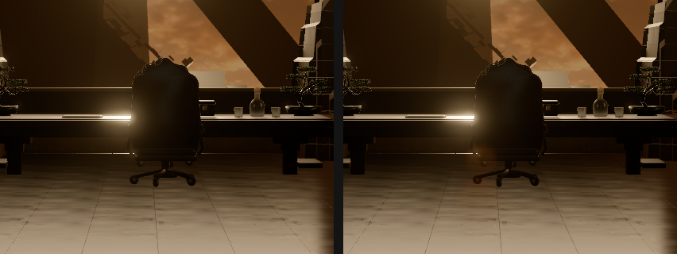
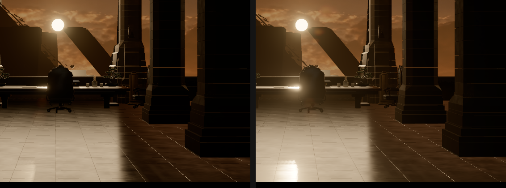

# Añadidos posteriores a la fase 7 · Destello del sol y paneo con el ratón

Fecha: 08/09/2026. Estado: **los dos completados**. Chrome 152, WebGPU, Three.js r185.

Dos peticiones fuera del plan de fases, hechas cuando la fase 7 ya estaba cerrada. Se documentan aparte porque no pertenecen a ninguna fase: el destello es acabado, que es territorio de la fase 6, y el paneo es presentación, que es de la 7, y las dos estaban entregadas con su propia evidencia.

Datos completos en [`destello-paneo.json`](destello-paneo.json).

## Destello del sol

Se usa `lensflare()`, el nodo TSL de r185, dentro de la `RenderPipeline` que la fase 6 construyó. **Se alimenta del bloom que ya se calcula**, y de ahí sale lo mejor del asunto: la oclusión es gratis. Los fantasmas se construyen a partir de los puntos brillantes del bloom, así que cuando una columna tapa el sol su bloom baja y el destello se va con él. No hay ninguna prueba de visibilidad en ninguna parte, y no hace falta.

Medido: con el bloom apagado, mover la fuerza del destello de 0 a 2 cambia **0 píxeles**. No tiene de qué construir nada.

### La fuerza no es un mínimo, y conviene decirlo

El bloom de la fase 6 se ajustó midiendo contra el render de Blender y su fuerza salió de un mínimo real de error. **Aquí no hay contra qué medir**: el render de Blender no lleva destello y su compositor no tiene nodo para uno. El plan da autoridad a la película sobre el acabado, así que esto es una decisión de aspecto, y el barrido sólo puede decir cuánto cuadro toca cada valor.

| Fuerza | Cuadro tocado | Diferencia máxima |
| ---: | ---: | ---: |
| 0,5 | 0,26 % | 0,0627 |
| **1,0** | **0,44 %** | **0,1098** |
| 1,5 | 0,61 % | 0,1529 |
| 2,0 | 0,70 % | 0,1922 |

La respuesta sube todo el rato, sin codo. Se entrega **1,0**, que es donde el fantasma se lee sobre el sillón sin convertirse en una mancha; a 2,0 empieza a serlo. Queda escrito como lo que es.

El tinte **sí** tiene procedencia: los fantasmas son luz del sol dispersada dentro del objetivo, así que llevan su color, el (1, 0,69, 0,34) lineal del maestro, el mismo que ya usa la luz solar. No es un color elegido a ojo.

Coste: **343 llamadas de dibujo en CAM 01** frente a las 341 de la fase 6. Una pasada, a un cuarto de resolución.

### Lo que este destello no hace

El fotograma de referencia ([`Screenshot_1.jpg`](../../movie_screenshots/Screenshot_1.jpg)) enseña sobre todo **velo** alrededor del sol y una estría diagonal suave hacia abajo a la izquierda, más que una cadena de fantasmas. Este nodo hace fantasmas que pivotan alrededor del centro del cuadro, que es lo que ópticamente ocurre, pero no es lo que más se parece a la película. Una estría anamórfica escrita a medida se valoró y se descartó en su momento a favor del addon; sigue siendo la opción si algún día se quiere el carácter anamórfico del original.

## Paneo con el ratón

Al mover el ratón, la cámara se desplaza de su pose original **y sigue apuntando al mismo punto**. Lo que cambia es el paralaje: las columnas cercanas se mueven contra las pirámides del fondo mientras el encuadre se queda sobre su asunto. Una cámara que sólo se deslizara arrastraría el cuadro fuera de la composición que Blender autoró.

### El punto al que apunta está medido

Y hubo que medirlo dos veces. La primera versión lanzaba **un** rayo por el eje de la cámara. Resultado: las diez cámaras cayeron en el valor de reserva. La causa no era un fallo del rayo sino la composición: **CAM 01 está encuadrada sobre el sol a través del ventanal**, así que su píxel central es cielo y el rayo se va del edificio. Justo el plano donde el efecto más importa.

Ahora se muestrea el cuadro en una rejilla de 5 × 5 sobre el 60 % central y se toma la **mediana** de lo que toca. La mediana es el punto: ignora los pocos rayos que se escapan por el ventanal y los pocos que rozan una columna a un metro, y aterriza en la distancia de la que va el plano.

| Cámara | Pivote | Impactos | Más cerca | Más lejos |
| --- | ---: | ---: | ---: | ---: |
| CAM 01 · fotograma general | 12,84 m | 20/25 | 10,24 | 23,49 |
| CAM 02 · mesa y juntas | 5,26 m | 22/25 | 2,03 | 12,96 |
| CAM 03 · perfiles invertidos | 11,09 m | 21/25 | 3,08 | 17,77 |
| CAM 04 · recorrido lateral | 11,61 m | 20/25 | 5,09 | 18,90 |

Las diez cámaras miden. Ninguna usa el valor de reserva, que sólo queda para un modelo que llegara sin geometría delante.

### Lo medido en el navegador

| Comprobación | Declarado | Medido |
| --- | ---: | ---: |
| Recorrido de extremo a extremo | 0,28 m | **0,2689 m** |
| Ratón a la izquierda → cámara a la derecha | — | **+0,1345 m** sobre el eje derecho de la cámara |
| Ratón a la derecha → cámara a la izquierda | — | **−0,1344 m** |
| Error de mira contra el punto de foco | 0° | **0° a la izquierda y 0° a la derecha** |
| Pose en reposo | la original | **exacta**, posición y giro |

Los 0,2689 m contra los 0,28 declarados son el suavizado, que es asintótico y no llega del todo mientras el ratón sigue donde está.

### Dónde no actúa, y por qué

| Situación | Estado | Motivo |
| --- | --- | --- |
| Comparación 1920 × 800 | Apagado, **pose intacta comprobada** | Todas las medidas contra Blender dependen de que la pose sea la autora |
| Recorrido libre | Apagado, comprobado durante el paseo real | Allí el ratón ya gira la cabeza con bloqueo de puntero |
| Transición de cámara | Apagado | La transición manda sobre la cámara hasta que aterriza |
| Ratón fuera de la ventana | Vuelve al centro | Congelarlo donde salió el puntero sería peor que devolverlo |

El punto del reposo exacto merece una nota. El suavizado exponencial **nunca** alcanza su objetivo, así que por sí solo dejaría la cámara unas micras fuera de la pose original para siempre. Se vio en la primera medida: la cámara quedaba en −0,120005 en vez de −0,12. Ahora, cuando va de vuelta y está lo bastante cerca como para no verse, salta el resto, escribe esa pose una vez y **deja de escribir la cámara**. Las fases anteriores comparan fotogramas píxel a píxel y lo habrían notado.

## El panel

Trece mandos, con el estilo de los controles del visor y plegado por defecto. No es un cuadro de preferencias sino un instrumento de medida: lo que sale de él tiene que acabar en `config.js`, así que lleva un botón que escribe el bloque listo para pegar.

El tinte son **tres deslizadores lineales y no un selector de color**, a propósito: un `input[type=color]` devuelve un hex sRGB, y todos los colores de este proyecto son lineales. Convertir uno en otro en silencio es exactamente el error contra el que avisa `config.js`, así que el panel no da la ocasión.

En modo Presentación el panel **no se ve**, comprobado midiendo su altura en pantalla. La barra pasa de 14 controles a 3.

## Un error propio de la herramienta

El barrido del destello salió **desplazado un paso**: la fuerza 0,5 mostraba el fotograma de la 0, la 1,0 el de la 0,5, y así. La captura del visor es asíncrona —se pide en un fotograma y se codifica en el siguiente—, y la herramienta esperaba a que hubiera una imagen en el diálogo sin borrar antes la anterior, así que la espera terminaba de inmediato y leía la vieja.

El bucle de cámaras de la misma herramienta se libraba por casualidad: pide el diagnóstico antes de la captura, y el diagnóstico sustituye la imagen por texto. Ahora se limpia el diálogo explícitamente en los dos sitios.

## Límites de esta entrega

- El destello no está medido contra nada, y no puede estarlo. Su fuerza es una decisión de aspecto con un barrido al lado.
- No reproduce el velo ni la estría diagonal del fotograma de la película, que es lo que más carácter le da a aquel plano.
- El paneo mueve la cámara en **metros**, no en píxeles. Un desplazamiento en píxeles no está definido para una cámara de perspectiva: depende de la distancia de lo que se mire. Los 0,14 m horizontales y 0,07 m verticales están en el panel y en `config.js`.
- El pivote se mide una vez, al construir la escena. Si el modelo cambiara de geometría en marcha habría que volver a medirlo.
- **No se ofrece cifra de rendimiento**, por lo mismo que en las fases 3 a 7. Las llamadas de dibujo sí: 343 en CAM 01, dos más que sin destello.
