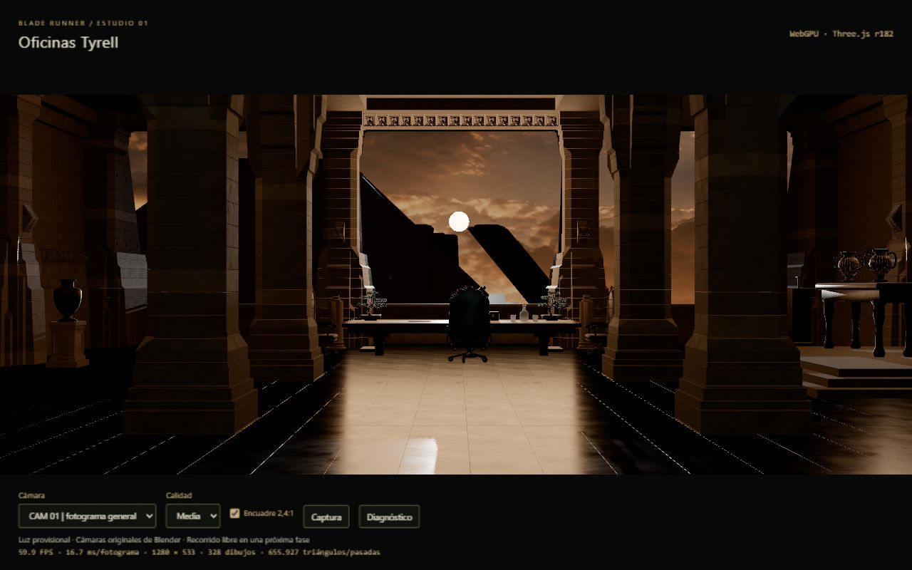
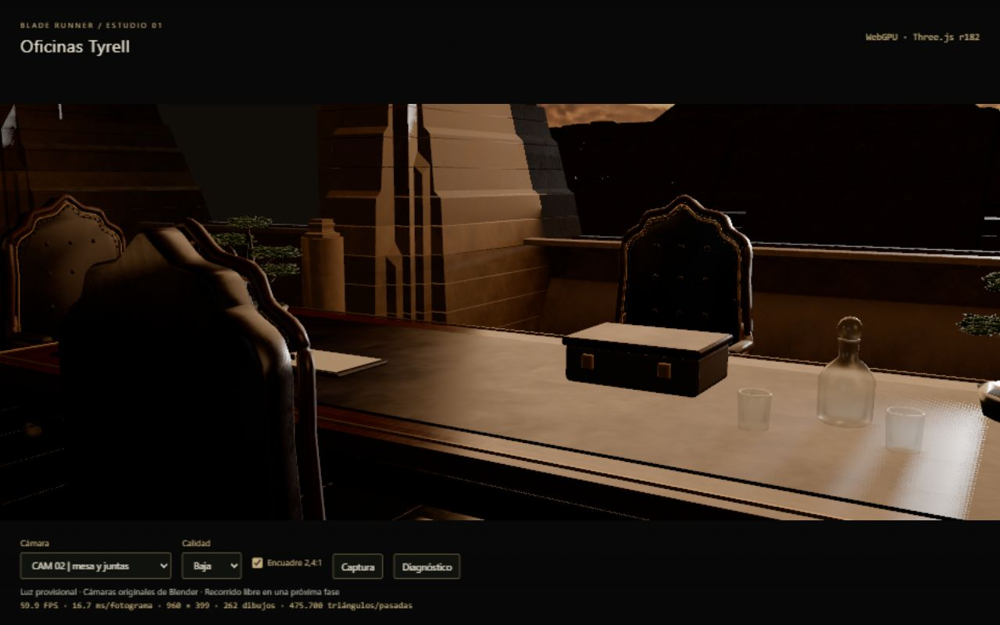

# Fase 1 · Validación y cierre

Fecha: 07/09/2026. Estado: **completada como visor técnico WebGPU**. Próxima entrega: fase 2, comparación de cámaras y fidelidad del modelo.

## Resultado entregado

Carga íntegra del GLB con progreso y cancelación, cámaras de perspectiva, encuadre 2,4:1, selección de calidad, iluminación provisional, captura PNG y diagnóstico JSON. La copia de ejecución coincide por tamaño y SHA-256 con el GLB de `_Blender`; su procedencia está en [manifest.json](manifest.json). No se ha modificado el Blender fuente en esta fase.

## Comprobaciones

| Comprobación | Resultado y alcance |
| --- | --- |
| Pruebas de integración | 6/6 correctas con Node 24.14.0; última ejecución 11,13 s |
| Cámaras | Pose mundial, FOV, escala de visualización de Blender y resize cubiertos por prueba con Three.js instalado |
| Cargador | HTTP 404, respuesta HTML inválida, aborto, progreso y conservación de cámaras/extras cubiertos por pruebas |
| Recursos compartidos | Geometría, materiales, mapas e ImageBitmap se liberan una vez en la prueba; no equivale a una prueba prolongada de memoria del navegador |
| Política WebGPU | Prueba de error y eliminación del canvas; Tyrell no acepta fallback WebGL. Los proyectos anteriores conservan su política de fallback |
| Integridad | 56.526.524 bytes, SHA-256 coincidente en fuente y copia; 117 recursos mesh, 25 imágenes, 10 cámaras |
| Producción | Webpack 5.97.1, compilación final de 84,22 s, sin errores y con 3 advertencias de tamaño |
| Correspondencia del build | Contenido de la entrada del proyecto comparado con el source map de `bundle.1454fe783c032c7a.js`: coincide |
| Arranque real | Producción servida por HTTP en localhost:8081, backend WebGPU, contexto seguro |
| Interacción real | CAM 01 → CAM 02 → CAM 04 → CAM 01; Media → Baja → Alta → Media; encuadre con y sin bandas; render y métricas continúan |
| Redimensionado | Ventanas de 1280 × 800 y 1920 × 1080; canvas de referencia 1280 × 533 y 1920 × 800. En Alta sin bandas: 1920 × 1200 para ventana 1280 × 800 |
| Captura y diagnóstico | PNG de mesa visible en el diálogo; JSON leído y guardado desde el diálogo del visor |
| Consola de producción final | Sin entradas de advertencia/error del bundle final durante el recorrido probado |
| Revisión de cambios | `git diff --check` sin errores de espacios; sin commit automático |

Comandos de validación ejecutados desde la raíz del repositorio:

```powershell
node --test --test-isolation=none src/canvasApp/projects/webGPU/E26902_BladeRunner/tests/phase1.test.mjs
node ./node_modules/webpack/bin/webpack.js --config ./bundler/webpack.prod.js
```

Los alias documentados son `npm run test:tyrell` y `npm run build`.

## Incidencia corregida durante el cierre

Al cambiar a Baja la imagen quedaba negra pese a continuar el contador de fotogramas. La resolución de sombras cambiaba de 2048 a 1024 con recursos aún referenciados por los nodos WebGPU. Liberar solamente el mapa, o reiniciar los nodos de la misma luz, no resolvía de forma estable la caché de esta versión.

La solución final sustituye la luz solar por una copia que conserva transformación, intensidad, objetivo y parámetros de sombra; asigna el nuevo tamaño antes de renderizar y libera la anterior. La nueva identidad permite reconstruir sus nodos y referencias. Se verificó el ciclo completo de calidades en producción: imagen visible y métricas activas. [Captura de mesa en Baja](produccion-detalle-baja.png) y [lateral en Alta sin bandas](produccion-lateral-alta.png).

## Referencia de rendimiento

Windows, navegador integrado basado en Chrome 152, Three.js r182, adaptador reportado como NVIDIA / Turing. El navegador no expone el modelo exacto ni descripción de GPU. Las mediciones son locales y puntuales, con otros procesos del equipo presentes; no fijan un compromiso de rendimiento ni una comparación fiable entre equipos.

Plano general, calidad Media, exposición 1,07:

| Evidencia | Resolución interna | FPS | Media RAF | P95 RAF | Muestras |
| --- | --- | --- | --- | --- | --- |
| [Medición inicial](general-1280.json) | 1280 × 533 | 59,9 | 16,71 ms | 18,5 ms | 120 |
| [Producción final](produccion-general-1280.json) | 1280 × 533 | 59,7 | 16,74 ms | 19,2 ms | 120 |
| [Producción final](produccion-general-1920.json) | 1920 × 800 | 59,7 | 16,76 ms | 18,3 ms | 120 |

En la producción final a 1280: 328 llamadas, 655.927 triángulos contando pasadas, 158 geometrías y 34 texturas reportadas por el renderer. La escena contiene 175 objetos mesh y 378.164 triángulos contando repeticiones. La carga local registrada fue 602,8 ms con recursos potencialmente cacheados; no es una medición de descarga en frío ni de tiempo hasta primera imagen.

Cada medición descarta 60 fotogramas y utiliza hasta 120 intervalos RAF. Los FPS incluyen presentación y pueden estar limitados por la frecuencia de pantalla. No se midió tiempo GPU, consumo de VRAM en bytes ni rendimiento sostenido. Para fijar el objetivo final hay que acordar modelo de GPU y medir con los efectos de las fases siguientes.

## Evidencia visual y límites





Se reconocen composición, columnas con juntas, mobiliario y exterior. Permanecen diferencias claras: sombras muy cerradas, respuesta brillante del suelo y mesa pendiente de calibrar, bordes de juntas de alto contraste, exterior en silueta y falta de profundidad atmosférica. No se ha demostrado aún equivalencia con los renders de Blender o los fotogramas de la película.

Pendiente por diseño del plan:

- Fase 2: comparación sistemática de plano general, detalle y lateral; revisar todas las columnas, normales, caras, celosías y mobiliario. Las cámaras importadas aún requieren validación artística.
- Fases 3–4: materiales, color, iluminación indirecta, contactos y calibración de sombras/rellenos.
- Fases 5–6: reflejo planar del suelo, bruma, haces y acabado cinematográfico.
- Fase 7: recorrido libre, transiciones y colisiones simplificadas.
- Fase 8: compresión y empaquetado de producción; actualmente `static/` incluye ejemplos ajenos y fuentes PSD/BLEND que también se copian. Las tres advertencias de Webpack corresponden a tamaño de recursos, entrada y recomendaciones de optimización.

La pérdida real del dispositivo GPU durante una sesión y una prueba prolongada de abrir/cerrar el proyecto no se han inducido. La evidencia de errores y liberación se limita a las pruebas descritas. No se han añadido efectos ni geometría para ocultar diferencias visuales.
