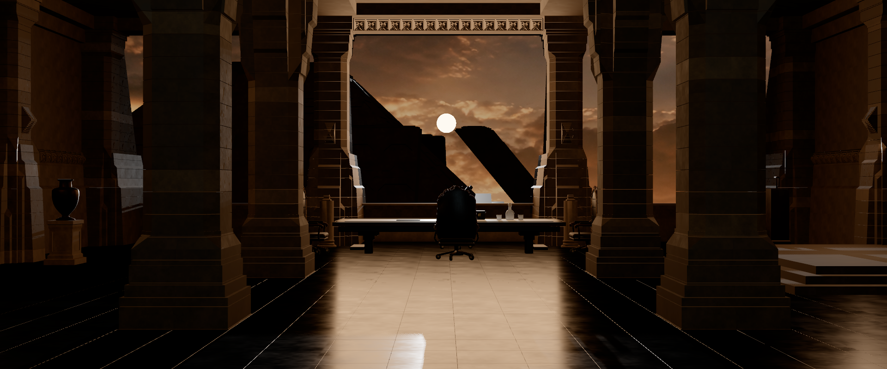

# Fase 2 · Captura de referencia 1920 × 800

Entrega parcial del 07/09/2026. **Punto completado y trabajo pausado para revisión del usuario.** La fase 2 completa sigue abierta.

## Punto elegido

Añadir una captura de comparación a 1920 × 800 y encuadre 2,4:1, independiente del tamaño de la ventana. Es la base para comparar encuadres con Blender sin que la pantalla o la calidad de resolución cambien las dimensiones del archivo.

El botón **Captura 1920 × 800** genera un PNG sin interfaz, conserva posición, orientación y FOV vertical de la cámara seleccionada y aplica aspecto 2,4. Utiliza una copia temporal de la cámara. Renderiza con resolución interna 1920 × 800 y factor de píxel 1, toma el PNG y restaura inmediatamente cámara, tamaño y calidad del visor. Reinicia la medición para que las pasadas de captura no contaminen las métricas posteriores.

La calidad de **sombras** se conserva: para comparaciones artísticas usar Media en todas las capturas. La captura mantiene 1920 × 800 también en Baja/Alta, aunque cambie la resolución del visor. El diagnóstico indica fase 2 y el formato de referencia; sus métricas siguen correspondiendo al visor en vivo, no al coste de exportar el PNG.

## Validación

- Nueve pruebas correctas: seis de integración existentes y tres nuevas para dimensiones fijas, conservación de pose/FOV/tamaño/calidad, restauración tras fallo de render y aviso si no se genera PNG.
- Compilación final de producción sin errores: Webpack 5.97.1, 62,30 s, `bundle.ac16dc66d941730a.js`; persisten las tres advertencias de tamaño de recursos del andamiaje.
- Navegador WebGPU real (Chrome 152, NVIDIA Turing): PNG abierto en el diálogo y descargado. Dimensiones naturales verificadas: **1920 × 800**.
- Caso Media con bandas: canvas en vivo **757 × 315** antes de capturar y restaurado a ese tamaño después; PNG **1920 × 800**. Pose y FOV original conservados, métricas reanudadas.
- Caso Baja sin bandas, ventana vertical: canvas en vivo **567 × 954**, PNG **1920 × 800**; tras capturar se recupera la vista vertical y continúa el render.
- Imagen descargada inspeccionada visualmente: contiene la escena completa del encuadre de referencia, sin controles ni bandas incluidas en el PNG.

Comandos, desde la raíz del repositorio:

```powershell
npm run test:tyrell
npm run build
```

La implementación está en `TyrellCapture.js`, integrada desde `E26902_BladeRunner` y `TyrellUI.js`. Las pruebas nuevas están en `tests/phase2.test.mjs`. El comando de pruebas ejecuta ahora ambos archivos.

## Evidencia y recurso activo

Las capturas de esta entrega usan la exportación que está actualmente configurada en el proyecto: `BladeRunner_5_6_High_v3_edited.glb?v=2`, 40.549.528 bytes, SHA-256 `7b860e4fa93da9380d7cdc3f38116d6905f5907d68086c1fd36c6ba895ba334c`. Contiene 107 recursos mesh, 25 imágenes y 10 cámaras; el visor registra 148 objetos mesh y 346.025 triángulos de escena. Esta entrega de captura no ha editado el modelo ni sustituido esa selección de recurso.

Los registros de `docs/phase1/` corresponden al GLB anterior y se conservan como evidencia histórica. No se deben atribuir diferencias entre esas imágenes y las actuales sólo al cambio de cámara o captura.



[PNG de comprobación con calidad Baja](general-baja-1920x800.png). Las dos imágenes tienen las mismas dimensiones; las diferencias de sombras entre perfiles son esperadas.

[Diagnóstico del visor tras recargar el build final](diagnostico-visor.json): WebGPU, fase 2 y formato de referencia 1920 × 800. Las métricas guardadas (59,8 FPS, ventana de 120 muestras) son de la vista en vivo a 757 × 315, no del PNG ni de su tiempo de generación.

## Revisión propuesta

1. Abrir el visor y seleccionar CAM 01 con calidad Media.
2. Pulsar **Captura 1920 × 800** y comprobar el PNG junto al render general de Blender al mismo tamaño.
3. Revisar altura de cámara, posición de mesa y silla, separación de columnas, apertura del hueco y presencia del exterior.

Se detiene aquí la ejecución. La comparación visual sistemática de todas las cámaras, la revisión de geometría/normales y las correcciones artísticas permanecen pendientes. La iluminación sigue siendo provisional y todavía no valida la atmósfera de la película.
