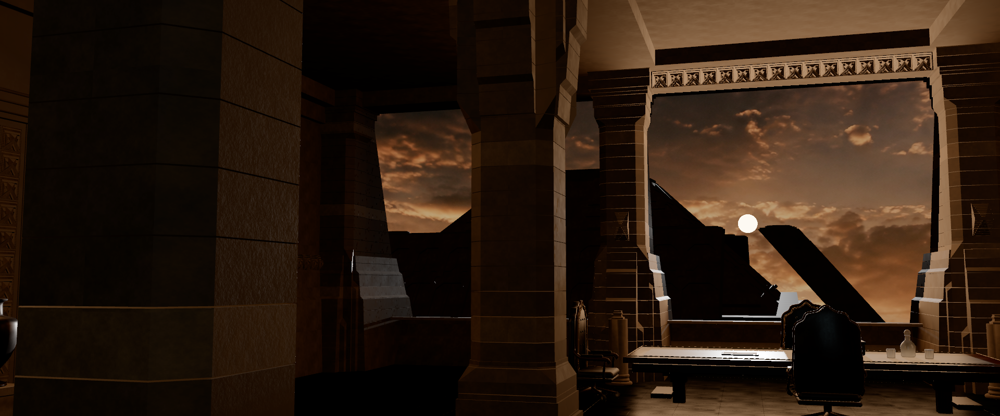
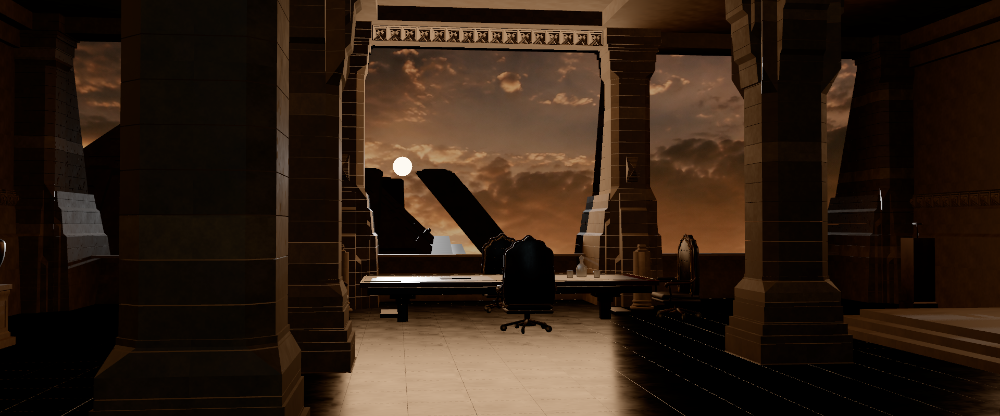

# Fase 2 · Columnas, mobiliario, celosías y exterior

07/09/2026. **Registro histórico del export `_edited.glb`.** El punto de superficies se ha completado después, con una copia de ejecución corregida. Consultar [CIERRE.md](CIERRE.md) para el estado final y las cifras actuales; los datos siguientes conservan la evidencia anterior a esa limpieza.

## Resultado

| Elemento | Comprobación | Resultado |
| --- | --- | --- |
| Columnas | Inventario, posición y secciones geométricas del GLB contra `Plantilla de referencia.blend` | 18 presentes; error máximo en los extremos de 432 secciones: **0,1154 mm** |
| Hiladas y juntas | Unión de intervalos verticales de todos los triángulos de cada columna | **24 hiladas y 23 huecos por columna**, aproximadamente **6 mm**; no depende del nombre ni de una textura |
| Perfiles invertidos | Anchura inferior/superior y contraste con la plantilla | **02, 03, 11 y 12** ensanchan hacia arriba; perfiles conservados |
| Sillones | Nodos, transformaciones y referencias de mesh | **4 instancias de una sola malla**, 6.424 triángulos únicos; 25.696 contando las cuatro instancias |
| Celosías y relieves | Inventario y posiciones de vértices contra el GLB anterior | **11 grupos, 63.560 triángulos**; mismos conjuntos de vértices mundiales |
| Pirámide exterior | Comparación directa de vértices mundiales con la plantilla | **39.654 triángulos**, error máximo al vértice más próximo **0,0341 mm**; volumen y emplazamiento conservados |
| Profundidad y paralaje | Geometría 3D, cambio de cámara y cálculo aislando traslación | Exterior a distinta profundidad de las columnas, visible desde general, perfiles y lateral |

No se ha modificado el GLB, el Blender, la iluminación ni los materiales durante esta comprobación. La geometría de ejecución sigue teniendo 346.025 triángulos de escena. Las columnas suman 143.337; se registra este coste para optimización posterior, sin aumentar densidad.

## Columnas y orientaciones

Los centros forman las filas X = −9, −3, +3 y +9 m. La conversión de ejes utilizada es glTF: `(x, y, z) = (Blender x, Blender z, −Blender y)`.

| Fila X | Columnas, en orden desde la entrada hacia el ventanal | Coordenadas Z en metros |
| --- | --- | --- |
| −3 | 01, 02, 03, 04 | +8,1015; 0; −5,4; −13,2 |
| +3 | 10, 11, 12, 13 | +8,1015; 0; −5,4; −13,2 |
| −9 | 05, 06, 07, 08, 09 | +8,1015; +2,7015; −2,6985; −8,1015; −13,2 |
| +9 | 14, 15, 16, 17, 18 | +8,1015; +2,7015; −2,6985; −8,1015; −13,2 |

En 02/03/11/12 la anchura de las secciones de control pasa de aproximadamente 1,01 m abajo a 1,40 m arriba. En las restantes se invierte esta relación; 09/18 conservan su perfil particular de la plantilla (aproximadamente 1,12 m abajo y 1,01 m arriba). Las secciones de control son los puntos medios de las hiladas 3 y 22; la validación usa las **24** hiladas, no sólo esas dos.

Las inversiones están incorporadas en la geometría exportada. Que los nodos del GLB no tengan una rotación de 180° no implica que falten las columnas invertidas.



## Mobiliario, celosías y exterior

Los sillones se sitúan en `(0,15; 0; −8,55)`, `(0,15; 0; −11,72)`, `(−3,12; 0; −10,20)` y `(+3,12; 0; −10,20)`, mirando hacia la mesa. Comparten el mesh 67 y mantienen sus posiciones respecto al GLB anterior. CAM 02 permite leer respaldo, tapicería, juntas y superficie de mesa; las cuatro sillas se comprueban combinando inventario y vistas, ya que no aparecen todas completas en un solo encuadre.

Las celosías son geometría, agrupada por sectores. CAM 03 y CAM 04 muestran el friso sobre el hueco y relieves laterales. El cotejo de los vértices no sustituye la revisión pendiente de normales, caras traseras y pequeños huecos de cada ornamento.

La pirámide ocupa aproximadamente X = −141,415…42,944 m, Y = −24,211…37,597 m y Z = −356,907…−172,655 m. Conserva profundidad real, separada del cielo a −900 m. Entre CAM 01 y CAM 04 cambia su ocultación por las columnas.

Para separar paralaje de giro de cámara se calculó una traslación horizontal de 1,78 m manteniendo orientación y FOV de CAM 01: a 1920 × 800, un punto de columna a Z = 0 se desplaza **341,0 px**, mientras el vértice superior del exterior se desplaza **12,2 px**. Son proyecciones geométricas calculadas, no medidas de flujo óptico sobre las imágenes; el cálculo no prueba visibilidad de esos puntos.



## Capturas y métricas

Cuatro PNG sin interfaz a **1920 × 800**, aspecto 2,4:1, calidad Media y exposición 1,07. Los diagnósticos se tomaron del visor a **757 × 315**: no confundir esa resolución con la de los PNG ni tratar estas muestras como rendimiento de la captura. WebGPU, Chrome 152/Windows, adaptador NVIDIA Turing; 120 muestras RAF tras calentamiento.

| Cámara | PNG | Diagnóstico | FPS | Media/P95 RAF (ms) | Llamadas | Triángulos con pasadas |
| --- | --- | --- | --- | --- | --- | --- |
| CAM 01 general | [Ver](model-audit/cam01.png) | [JSON](model-audit/cam01.json) | 57,0 | 17,55 / 24,2 | 276 | 600.011 |
| CAM 02 mesa | [Ver](model-audit/cam02.png) | [JSON](model-audit/cam02.json) | 58,9 | 16,99 / 18,4 | 219 | 426.164 |
| CAM 03 perfiles | [Ver](model-audit/cam03.png) | [JSON](model-audit/cam03.json) | 59,4 | 16,85 / 18,4 | 251 | 527.508 |
| CAM 04 lateral | [Ver](model-audit/cam04.png) | [JSON](model-audit/cam04.json) | 59,8 | 16,72 / 18,3 | 264 | 540.034 |

Las pequeñas diferencias de fluidez pueden depender de carga del equipo y presentación. No se ha efectuado un benchmark sostenido ni una medición de tiempo GPU.

## Evidencia y reproducción

Recurso: `BladeRunner_5_6_High_v3_edited.glb?v=2`, 40.549.528 bytes; SHA-256 `7b860e4fa93da9380d7cdc3f38116d6905f5907d68086c1fd36c6ba895ba334c`. Se conserva la versión activa. Los registros anteriores de fase 1 pertenecen al GLB previo.

El [script de auditoría](../../scripts/audit-model.py) abre la plantilla en un proceso Blender de fondo con ejecución automática desactivada, decodifica ambos GLB y escribe [geometry.json](model-audit/geometry.json). No guarda los archivos fuente. Desde la raíz del repositorio:

```powershell
& 'C:/Program Files/Blender Foundation/Blender 5.1/blender.exe' --background --factory-startup --disable-autoexec --python 'src/canvasApp/projects/webGPU/E26902_BladeRunner/scripts/audit-model.py'
```

Ejecución comprobada en Blender 5.1.1: 18 columnas, todas con 24 hiladas/23 juntas, perfiles compatibles con plantilla, cuatro sillas/una malla y 11 sectores de celosías. Se comparan extremos X/Z de secciones horizontales; tolerancia declarada 3 mm para el bisel de 2,5 mm, aunque el error medido queda por debajo de 0,116 mm. Esto no certifica cada cara de las superficies intermedias.

Los conjuntos de vértices de columnas, sillas, celosías y exterior coinciden con el GLB anterior, pero sus firmas de triángulos no son idénticas y algunos recuentos cambian ligeramente (pirámide: 39.654 frente a 39.652). Por ello el informe distingue coincidencia de vértices de identidad de topología; no declara igualdad binaria ni normales correctas.

## Pendiente para el siguiente punto

- Revisar con luz neutra o material de diagnóstico los fragmentos claros del exterior visibles en CAM 03/04 y los bordes muy contrastados. La evidencia actual no permite atribuirlos a normales, caras ausentes o iluminación.
- Comprobar transparencias de vasos/botella y contactos de mesa, sillones y suelo. La luz actual dificulta juzgar las zonas en sombra.
- Validar caras, normales, tangentes y penetraciones del mobiliario con pruebas específicas. Este punto permanece sin marcar en el plan.

Esta entrega acredita inventario, distribución, perfiles y profundidad. La fidelidad fotométrica y la atmósfera de la película siguen pendientes de las fases de materiales e iluminación.
