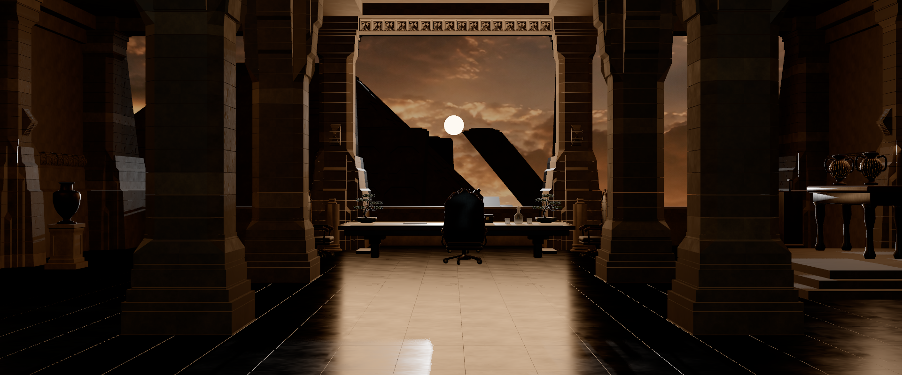

# Fase 2 · Cámaras y fidelidad del modelo

Fecha: 07/09/2026. Estado: **completada**. Corregida la sección de rendimiento durante la fase 3. Próxima entrega: fase 3, materiales y respuesta al color.

Esta fase comprueba forma, encuadre y composición. No toca luz ni materiales a propósito, para que la mejora de las fases 3 a 6 sea medible contra las capturas base que aquí se guardan. El objetivo artístico final está en [REFERENCIAS.md](../REFERENCIAS.md), a partir de los fotogramas aportados por el usuario.

## Lo entregado

Modo de comparación fijo de 1920 × 800, el mismo tamaño con el que se renderizaron `v3_general.png` y `v3_detalle.png` en Blender. Auditoría geométrica reproducible del GLB. Capturas base y métricas desde las tres cámaras de comparación, tomadas en Chrome real sobre WebGPU.

```powershell
npm run tyrell:audit      # auditoría del modelo, escribe auditoria.json
npm run build
npm run tyrell:capture    # sirve dist, abre Chrome y guarda capturas y diagnósticos
npm run test:tyrell       # 11 pruebas, fases 1 y 2
```

## El modo de comparación

Al activarlo, el destino de render queda clavado en 1920 × 800 con relación de píxel 1, sea cual sea la ventana. La hoja de estilo escala el lienzo dentro del encuadre 2,4:1 y la casilla de encuadre queda bloqueada, porque 1920 × 800 ya es 2,4:1. El perfil de calidad sigue mandando en la resolución de sombras pero deja de mandar en la resolución interna, que es justo lo que hace comparable una captura con otra.

Comprobado en dos ventanas distintas del mismo equipo:

| Ventana | Lienzo mostrado | Búfer de dibujo | PNG resultante |
| --- | --- | --- | --- |
| 1280 × 800 | 1264 × 527 | 1920 × 800 | 1920 × 800 |
| 1024 × 640 | 1008 × 420 | 1920 × 800 | 1920 × 800 |

Los tres PNG pesaron exactamente lo mismo en ambas ventanas, 1.609, 1.508 y 1.639 kB, así que la imagen no depende del tamaño de la ventana. Las tres cámaras conservaron su campo de visión de Blender y una relación de aspecto de 2,4 exacta.

## Auditoría del modelo

[`tools/auditar-modelo.mjs`](../../tools/auditar-modelo.mjs) lee el GLB entregado sin DOM ni decodificación de texturas y escribe [auditoria.json](auditoria.json). Recorre 120 nodos de malla y 378.164 triángulos contando repeticiones.

| Comprobación del plan | Resultado |
| --- | --- |
| 18 columnas | 18, todas de 5,800 m, giro 0° y sin espejo en la transformación |
| Juntas de las columnas | Presentes en las 18; paso medido de 0,2424 a 0,2450 m, coherente con las hiladas de 24,5 cm del Blender |
| Orientaciones invertidas | **No encontradas.** Tres familias de perfil distintas, 10 + 4 + 4, y ninguna coincide con otra invertida |
| Cuatro sillas | 4, compartiendo un único recurso de malla y escala 0,74 uniforme |
| Celosías y relieves | 11 sectores, 63.560 triángulos |
| Edificio exterior con paralaje | Pirámide de 184 × 62 × 184 m a 269 m del origen, geometría tridimensional real; su centro se desplaza 1,18 en NDC entre las cámaras de comparación |
| Caras ausentes | 87 mallas cerradas y 33 con contorno abierto; las de mayor contorno son bonsáis, pirámide y águilas, abiertas por diseño |
| Normales | Las 120 primitivas traen el atributo y todas son unitarias |
| Tangentes | 135 primitivas usan mapa normal y todas traen tangentes |
| Escalas | Ninguna negativa; una sola no uniforme, el tapón de cristal |
| Transparencias | 27 materiales, ninguno con mezcla ni máscara, uno con transmisión |
| Colisiones del mobiliario | 15 conjuntos; ningún solape profundo entre conjuntos distintos |

La banda que mide el método incluye el microbisel de la hilada superior, la junta y el microbisel de la inferior, de 22 a 35 mm en total. No aísla los 6 mm de junta pura que declara la validación de Blender; lo que verifica es que las juntas existen y se repiten con el paso correcto.

## Hallazgos

1. **Ninguna columna es el reflejo vertical de otra.** Hay tres perfiles distintos, no un perfil y su inversión. La documentación del modelo y el propio nombre de CAM 03, «perfiles invertidos», dan a entender lo contrario. La medida es fiable porque ningún perfil es simétrico: la distancia de cada columna a su propio reverso va de 0,176 a 0,237, muy por encima del umbral de coincidencia de 0,05. **Pendiente:** confirmarlo mirando CAM 03 contra Blender y corregir el modelo o el nombre de la cámara.
2. **La consola flota 40 mm sobre el podio.** Es el único conjunto que no apoya. Los otros 14 apoyan dentro de 5 mm.
3. **Los 27 materiales son de doble cara.** Sin descarte de caras traseras se paga relleno de más y las sombras necesitan más sesgo. Decidir en la fase 4 si conviene activar el descarte por material.
4. **17.125 triángulos declaran normal opuesta a su devanado, repartidos en 37 mallas.** En cartelas de follaje de doble cara esto es normal por definición. Conviene revisar los casos que no son follaje antes de calibrar la luz.
5. **3.846 triángulos degenerados y 18.583 aristas compartidas por más de dos caras.** No se ven en pantalla, pero afectan al sesgo de sombra y al horneado si la fase 4 lo incorpora.

## Comparación con Blender

Las tres capturas base están junto a este documento. Se regeneraron durante la fase 3 con la casilla «Look AgX de Blender» desactivada, que es el estado en el que cerró esta fase, así que siguen siendo la referencia contra la que se mide la mejora de la fase 3. Composición, siluetas y encuadre coinciden con los renders de Blender en las tres cámaras: columnas, vano, pirámides, mesa, sillones, bonsáis, cristalería y mobiliario lateral caen en el mismo sitio y al mismo tamaño.



Lo que no coincide es la luz y el material, y corresponde a las fases siguientes:

- **Suelo.** Sale como baldosa clara y lavada en el centro del pasillo. En Blender y en la película es piedra oscura muy pulida con reflejo vertical largo. Fases 3 y 5.
- **Friso superior.** Aparece plenamente iluminado. En las dos referencias queda casi en penumbra. Fase 4.
- **Cuero de la mesa.** Sale crema; en Blender es marrón muy oscuro. Fase 3.
- **Cristalería.** La copa y la licorera salen lechosas y opacas. En Blender son vidrio transparente con refracción. Es el único material con transmisión del GLB y hay que comprobar cómo lo resuelve WebGPU en r182. Fase 3.
- **Profundidad atmosférica.** No existe, así que las pirámides se recortan con bordes duros contra el cielo. Fase 6.
- **Juntas de alto contraste.** Las aristas de juntas y columnas producen líneas claras marcadas. Conviene comprobar si es aliasing del especular o del contorno antes de dar por buena la fase 4.

## Rendimiento en el encuadre de comparación

**Corregido el 07/09/2026 durante la fase 3.** Esta sección publicaba 44,6, 41,5 y 46,6 fotogramas
por segundo para CAM 01, CAM 02 y CAM 04. Repitiendo la medición sobre la misma compilación y los
mismos ajustes salieron 59,9 en las tres, y más tarde valores de 22 a 32. La dispersión no depende
de la cámara ni de la escena, así que aquellas cifras no describían el visor sino el estado del
equipo tras varias compilaciones seguidas.

Lo que sí queda registrado, porque no depende del reloj:

| Cámara | Llamadas de dibujo | Triángulos por pasadas | Resolución |
| --- | ---: | ---: | --- |
| CAM 01 | 328 | 655.927 | 1920 × 800 |
| CAM 02 | 262 | 475.700 | 1920 × 800 |
| CAM 04 | 313 | 593.851 | 1920 × 800 |

Los diagnósticos completos están en los tres archivos `base-*.json`. La medición de fluidez
pertenece a la fase 8, sobre el dispositivo acordado y con el equipo en reposo. La herramienta de
captura hace ahora una pasada de calentamiento por las tres cámaras antes de medir.

## Límites de esta entrega

La auditoría razona sobre cajas alineadas a los ejes y sobre la silueta de revolución de cada columna. Señala dónde mirar y no sustituye la revisión en pantalla. El perfil de columna se mide como radio máximo desde el centro de su caja, así que una columna adosada o de sección no centrada se mediría peor.

No se ha comprobado todavía CAM 03 contra Blender, que es la cámara donde debería verse el asunto de los perfiles invertidos. No se ha inducido pérdida del dispositivo GPU ni una sesión prolongada. No se ha modificado el `.blend` original ni el GLB. No se ha añadido ningún efecto para disimular diferencias visuales.
