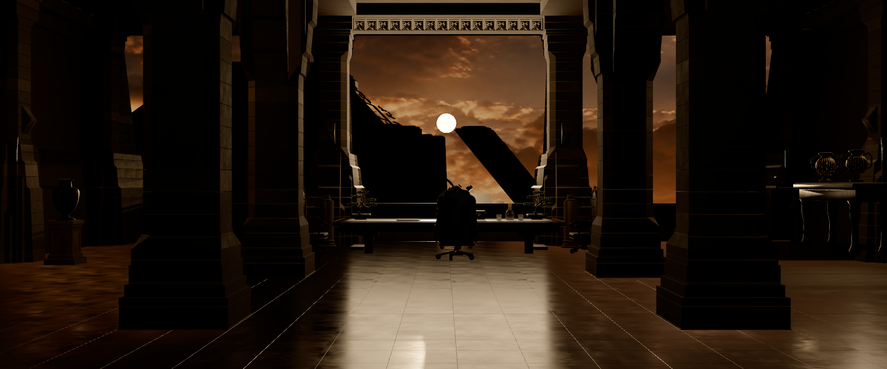

# Fase 5 · Reflejos del pavimento y materiales pulidos

Fecha: 08/09/2026. Estado: **bloqueada**. El reflector planar está escrito y produce la imagen correcta, pero **congela el lienzo**, así que se entrega desactivado. La fase no se da por cerrada.

## Lo que se ve cuando funciona

Durante los primeros fotogramas el reflejo es exactamente lo que la fase pedía: las columnas se estiran a lo largo del pavimento, la mesa y el sillón aparecen invertidos bajo ellos, y el lateral del suelo deja de ser negro plano.

Medido en ese estado, el lateral izquierdo del pavimento sube de 0,0116 a **0,0208** de luminancia contra los 0,0354 de Blender, es decir de −1,63 a **−0,79 EV**. Es la mayor mejora que ha tenido esa región en todo el proyecto.

## El defecto

Después de unos fotogramas **la imagen presentada deja de actualizarse**. El renderizador sigue dibujando la cámara correcta (las llamadas de dibujo cambian con ella: 433, 303 y 401 para CAM 01, CAM 02 y CAM 04), pero el lienzo conserva el último fotograma bueno.

No es un artefacto de la herramienta de captura. Leyendo el lienzo desde la propia página con `drawImage`, tras cambiar de cámara cuatro veces y esperar entre cada una, la firma de los píxeles y su media salen **idénticas las cuatro veces**: 4033306470 y 24,37. Las tres capturas de las tres cámaras son además byte a byte el mismo archivo.

En el camino aparecen avisos de WebGPU, más de mil por sesión: `Destroyed texture used in a submit`, alternando dos tamaños. Con el reflector a escala 0,5 y el lienzo a 1920 × 800 son 960 × 400 y 1920 × 800, es decir el destino del reflector y el del posprocesado. Chrome descarta esos envíos, y ésa es la razón de que el lienzo no avance.

## Lo que se descartó, midiendo

| Hipótesis | Prueba | Resultado |
| --- | --- | --- |
| Es el muestreo múltiple del destino | `samples` de 4 a 0 | Sigue igual |
| Es dónde mezclo el reflejo | `emissiveNode` frente a `colorNode` | Congela en ambos |
| Es sólo el redimensionado | Marcar cuándo ocurre cada aviso | Dos tipos son transitorios, otros dos van de +21,6 s a +34,3 s, es decir por fotograma |
| Se arregla soltando el material al redimensionar | Pausa de dos fotogramas | No cambia nada |
| Es el desajuste de tamaños | `resolutionScale` a 1 | Desaparecen los avisos y **la imagen sale blanca** |

Ese último resultado es el que cierra el diagnóstico. Con tamaños distintos, el destino del reflector y el búfer de posprocesado se redimensionan uno contra otro cada fotograma y se destruyen texturas en vuelo. Con tamaños iguales dejan de pelearse y pasan a solaparse: el suelo acaba muestreando el mismo búfer en el que se está dibujando y la realimentación lo satura a blanco. Los dos síntomas son la misma causa.

El espacio de color sí está bien y se comprobó: `Renderer.currentToneMapping` devuelve `NoToneMapping` cuando el destino no es el de salida, así que la textura del reflejo es lineal y sumarla al emisivo no la mapea dos veces.

**Conclusión: es un conflicto entre `reflector()` y el destino de posprocesado que el mapeo tonal obliga a usar, en Three.js 0.185.1.** No es un mal uso de la API por parte del proyecto.

## Lo que sí queda hecho

El módulo [`TyrellReflection.js`](../../TyrellReflection.js) está escrito y resuelve lo que la fase pedía, salvo el punto que el motor bloquea.

- **Un solo reflector para todo el pavimento.** Los 21 sectores comparten el material «PBR | Piedra negra pulida», así que basta con sustituir ese material por uno de nodos: una pasada extra, no veintiuna. Nada se clona por malla.
- **El plano sale de la geometría.** Altura y centro se calculan de las cajas de los propios sectores. El objetivo se tumba con un giro de −90° en X porque un reflector toma su normal del +Z de su objetivo.
- **No es un espejo uniforme.** Fresnel de Schlick contra la normal sombreada, con F0 de 0,04 para piedra dieléctrica, de modo que el reflejo es tenue de frente y domina en rasante, que es lo que dibuja las trazas largas de la referencia. El desenfoque lo elige el propio mapa de rugosidad del material, así que lo desgastado dispersa y lo pulido queda nítido. La normal sombreada ya incluye el mapa de normales, así que las juntas cortan el reflejo.
- **Dónde se suma, y por qué.** Va al emisivo, que se añade después del BRDF y no lo multiplica ningún término de luz. Es el sitio correcto para un espejo: un suelo pulido en sombra sigue reflejando. Mezclarlo en el color base, que es el atajo habitual, dejaría que la luz directa modulase el reflejo y lo apagaría justo donde la referencia lo enseña más fuerte.
- **Sin recursión y con resolución controlada.** `bounces: false`, que además baja el reflector de una vez por render a una vez por fotograma, y `resolutionScale` a 0,5.

El coste medido, cuando corre: las llamadas de dibujo pasan de 328 a 433 en CAM 01, de 262 a 303 en CAM 02 y de 313 a 401 en CAM 04.

## Estado de cada punto

| Punto | Estado |
| --- | --- |
| Reflector planar compartido por el pavimento | Escrito y correcto en imagen, **bloqueado por el motor** |
| Integrarlo con rugosidad, Fresnel, normales y juntas | Hecho, dentro del módulo |
| Comprobar columnas y mobiliario reflejados al cambiar de cámara | **No se puede**: el cambio de cámara es justo lo que revela el congelado |
| Controlar resolución y frecuencia; evitar recursión | Hecho: 0,5, sin rebotes, una pasada |
| Entorno de reflexión coherente para bronces y cristalería | Ya lo da la sonda de escena de la fase 4, y sigue activa |

## Qué haría falta para desbloquearla

Tres caminos, ninguno probado todavía:

1. Renderizar el reflejo a un destino que no comparta el búfer de posprocesado, lo que exigiría no usar el mapeo tonal del renderizador y llevarlo a una pasada de posprocesado propia. Eso es además lo que la fase 6 va a necesitar para el bloom, así que puede resolverse allí.
2. Sustituir el reflector por una implementación propia con `CubeCamera` o con una cámara espejo manual, sin pasar por `ReflectorNode`.
3. Informar del fallo aguas arriba y esperar.

La primera es la que encaja con el plan, porque la fase 6 introduce posprocesado de todas formas. Conviene reintentar la fase 5 después de esa, no antes.

## Límites de esta entrega

No hay cifras de comparación contra Blender para el estado final, porque el estado final no lleva reflejo: las capturas de esta carpeta son idénticas a las de la fase 4. La medida de −0,79 EV en el lateral del pavimento corresponde al primer fotograma bueno y no a un estado sostenido.

Los materiales pulidos que no son el pavimento, bronces y cristalería, no se han tocado. Siguen con el entorno de la fase 4.

**No se ofrece cifra de rendimiento**, por el mismo motivo que en las fases 3 y 4: este equipo no da lecturas reproducibles. Las llamadas de dibujo sí quedan registradas arriba.
