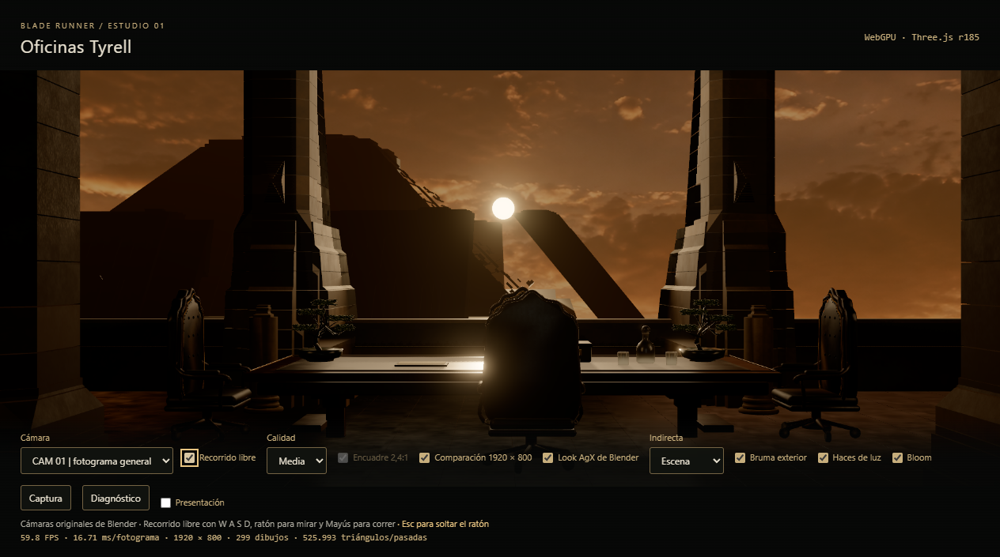
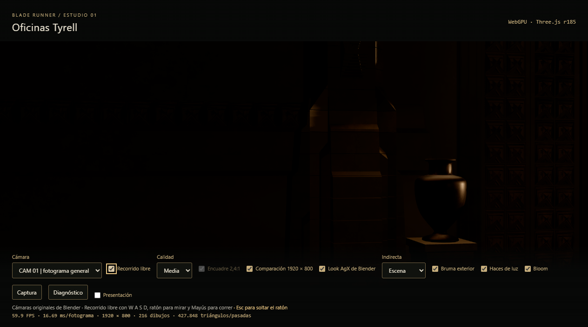
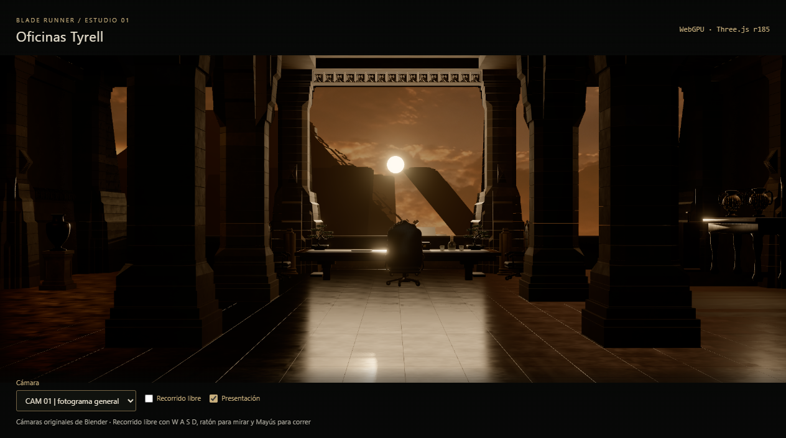

# Fase 7 · Navegación y presentación

Fecha: 08/09/2026. Estado: **los cinco puntos completados**. Chrome 152, WebGPU, Three.js r185, ventana 1280 × 800.

El usuario pidió recorrido libre **y** cámaras de la película. Ninguno sustituye al otro: las cámaras siguen siendo la referencia con la que se compara contra Blender, y salir a andar devuelve exactamente el encuadre del que se salió, **píxel a píxel**.

## Nada de esto es un número elegido a ojo

El andador toma del modelo las tres cosas que necesita:

| Qué | De dónde sale | Valor medido |
| --- | --- | ---: |
| Altura de ojo | Mediana de las alturas a las que se colocaron las cámaras de Blender | **1,62 m** |
| Suelo | Cara superior de los sectores de pavimento | 0,00 m |
| Obstáculos | Cajas de las mismas mallas que ya se recogían para las sombras | 150 |

Las diez cámaras del GLB están a 1,278, 1,435, 1,45, 1,55, 1,62, 1,65, 1,80, 1,80, 1,868 y 3,193 m. La última es `Camera_free`, muy por encima de la altura de una persona, y queda fuera por el filtro de 0,5 a 3 m; la mediana de las nueve restantes es 1,62. Si el modelo llegara algún día sin cámaras utilizables, hay un valor de reserva en `config.js`, y sólo entonces se usa.

El pavimento y el mortero no son obstáculos: son el suelo. Las superficies sin espesor tampoco, porque no se puede chocar contra ellas y sólo cuestan tiempo de comprobación.

## Lo que hizo el navegador

Medido con teclado y ratón **reales**, despachados por el navegador con `Input.dispatchKeyEvent` e `Input.dispatchMouseEvent`, sobre la página ya animada. Los datos completos están en [`fase7-paseo.json`](fase7-paseo.json).

| Comprobación | Declarado | Medido |
| --- | ---: | ---: |
| Velocidad andando | 1,4 m/s | **1,402 m/s** (3,531 m en 2,52 s) |
| Velocidad corriendo | 3,2 m/s | **3,168 m/s** (6,437 m en 2,03 s) |
| Duración de la transición | 1,2 s | **1,135 s** leídos del reloj del propio interpolado |
| Error de pose al volver | 0 | **0 m y 0° de campo** |
| Lienzo al volver | idéntico | **0 píxeles distintos de 554.896** |
| Giro con el ratón | — | −15,13° con bloqueo de puntero concedido |

## El choque, contra la predicción del propio andador

En vez de dar por bueno que «no atraviesa paredes», la herramienta pregunta al modelo de colisión del andador en qué dirección está el muro más cercano —marchando su propia prueba `blocked()` en 72 direcciones— y después camina hacia allí corriendo, el doble de tiempo del que haría falta.

- Distancia predicha: **1,80 m**. Recorrida: **2,15 m**.
- Terminó **fuera de todo obstáculo** y **dentro de los límites** del modelo, a 1,62 m del suelo.

Los 35 cm de más no son un fallo: el movimiento se resuelve eje a eje, así que al llegar al muro sigue deslizando de lado en lugar de clavarse. Eso es lo que hace pasables las esquinas, y es la razón de anotar predicción y recorrido por separado en vez de una sola cifra.

Fuera del navegador, `tests/phase7.test.mjs` repite el choque contra un pilar **desde 36 direcciones** y comprueba que en ninguna acaba dentro. También comprueba que un fotograma tardío no teletransporta: entregando al bucle un delta de 30 segundos —lo que ocurre al volver de una pestaña oculta— el andador avanza como mucho una décima de segundo de movimiento, 0,14 m, y no cruza el muro.

## Foco, redimensionado y pausa

| Situación | Comportamiento medido |
| --- | --- |
| Pestaña oculta | `ACTIVE` pasa a `false` y se dibujan **0 fotogramas en un segundo** |
| Pestaña de vuelta | `ACTIVE` vuelve a `true` y se dibujan **33 fotogramas en un segundo** |
| Ventana a 900 × 600 | El búfer pasa de 1264 × 527 a **900 × 375** y vuelve al recuperar el tamaño |
| Modo comparación | El búfer se clava en **1920 × 800** a propósito, y por eso se apaga antes de medir el redimensionado |
| Esc | Suelta el ratón **sin salir del recorrido**; un clic en el lienzo lo recupera |
| Ventana sin foco | `blur` vacía las teclas pulsadas, así que ninguna se queda hundida |

Sólo se capturan las teclas que el recorrido usa; Tab y el resto siguen llegando a la página, y con el recorrido apagado no se captura ninguna.

## Separar la revisión de la experiencia

La casilla **Presentación** deja **3 controles de 13**: cámara, recorrido libre y la propia casilla. Desaparecen calidad, encuadre, comparación, look, indirecta, los tres efectos, captura, diagnóstico y el contador de fotogramas. Las cámaras de la película se quedan, que era la condición.

## Un error propio que conviene dejar escrito

El recorrido pareció no funcionar durante un buen rato. La sonda decía `rafsEnUnSegundo: 0`, `llamadasNavegacion: 0` y las teclas vacías, mientras que un `navigation.update(0.016)` a mano sí movía al andador.

No era el producto: era **dónde se medía**. La opción `--eval` de la herramienta de captura se ejecuta antes del calentamiento, con la página todavía sin animar, así que no había fotograma en el que moverse. Por eso el paseo se ha implementado como un modo propio de la herramienta, `--paseo`, que corre después del calentamiento y espera a que haya fotogramas de verdad antes de tocar nada.

De paso, un `KeyboardEvent` sintético demuestra que el manejador funciona, no que el navegador entregue la tecla. El segundo detalle apareció solo: al activar el recorrido con un evento `change` despachado, el navegador **rechazaba el bloqueo de puntero** por no venir de un gesto del usuario. La herramienta pasó a hacer clic de verdad sobre la casilla, que es lo que hace una persona, y entonces el bloqueo se concede.

## Cómo se comparó el encuadre

La captura del compositor completa **nunca** sale idéntica: lleva el contador de fotogramas, que cambia cada segundo. Las diferencias entre la captura de antes y la de después caían todas en la banda `y` 568 a 685, que es la barra de controles. La comparación se hace por tanto sobre el lienzo y por encima de esa barra: 554.896 píxeles, **cero distintos**, diferencia máxima 0.

## Límites de esta entrega

- El desplazamiento del ratón se despacha con coordenadas sintéticas, así que el giro de −15,13° prueba que el bloqueo de puntero y el manejador funcionan, no que la sensibilidad esté calibrada para una mano. El cabeceo se movió 0,13° al mover sólo en horizontal, ruido del puntero sintético.
- Las colisiones son cajas alineadas con los ejes, no la geometría. Una columna redonda se rodea como si fuera cuadrada. Es deliberado: 150 cajas se prueban por fotograma sin coste apreciable, y el error es de centímetros contra un obstáculo que de todas formas no se puede atravesar.
- El suelo se resuelve por altura de caja, así que una rampa se sube a escalones del tamaño de sus cajas. En esta sala no hay ninguna.
- **No se ofrece cifra de rendimiento**, por lo mismo que en las fases 3 a 6: este equipo no da lecturas reproducibles. Las capturas de esta carpeta muestran 59,8 FPS con 299 dibujos durante el paseo, y esa lectura vale para esa ventana y ese momento, no como promesa.
- El recorrido no aparece en el modo comparación de 1920 × 800 por ninguna razón de fondo; simplemente esa vista existe para medir contra Blender y el paseo no se mide contra nada.
